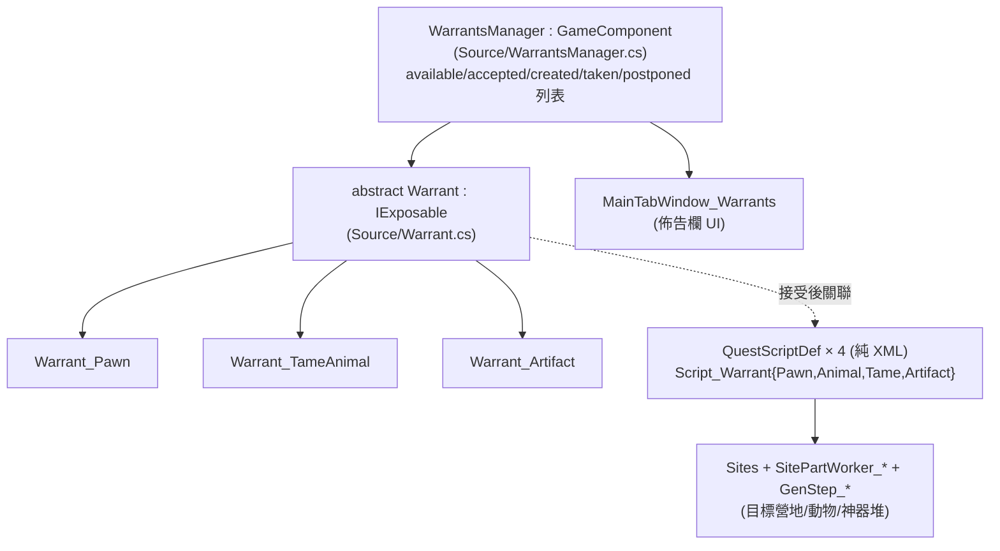

# Simple Warrants 架構總覽（00_overview）

> 目標導向：analysis→create。核心釐清「純 XML 可做 vs 必須 C#」與擴充接點。
> **本 mod 自帶完整原始碼**（`1.6/Source/*.cs` ＋ `SimpleWarrants.sln`），引用一律指原始碼路徑，無需反編譯。

## 1. 一句話定位

`pb3n.SimpleWarrants`（workshop 2676828755，作者 pb3n + Taranchuk）加入一塊**懸賞/通緝佈告欄**：各派系（與玩家）會張貼懸賞——通緝某個 pawn（生擒或擊殺）、獵殺/馴服某動物、取回某神器；玩家可接單賺賞金，也可自己張貼懸賞請他人代勞。主介面由 `MainButtonDef` 開啟。

## 2. 相依與組件

- 相依：僅 Harmony（無 DLC 硬相依）。
- 開源（GitHub 風 .sln），約 4682 行 C#，組織乾淨。

## 3. 核心型別（皆 `SimpleWarrants` 命名空間）

| 型別（原始碼） | 角色 |
|---|---|
| `abstract Warrant : IExposable, ILoadReferenceable`（`Source/Warrant.cs:13`） | 懸賞基類：發行者/接受者/賞金/狀態/關聯 Quest，抽象 `AcceptChance/SuccessChance/MaxRewardValue/IsWarrantActive` |
| `Warrant_Pawn`（`Source/Warrant_Pawn.cs`） | 通緝人物（生擒 `rewardForLiving` / 擊殺 `rewardForDead` 兩種賞金） |
| `Warrant_TameAnimal`（`Source/Warrant_TameAnimal.cs`）/ `Warrant_Artifact`（`Source/Warrant_Artifact.cs`） | 動物 / 神器懸賞 |
| `enum TargetType { Human, Animal, Artifact }`（`Source/TargetType.cs`） | 懸賞目標種類（**封閉列舉**） |
| `enum WarrantStatus`（`Warrant.cs:283`） | Accepted/Completed/Failed/Expired |
| `WarrantsManager : GameComponent`（`Source/WarrantsManager.cs`） | 持五張懸賞列表、生成/到期/結算驅動 |
| `MainTabWindow_Warrants`（`Source/MainTabWindow_Warrants.cs:1`，695 行） | 佈告欄 UI |
| `WarrantRequestComp`（`Source/WarrantRequestComp.cs`） | 交易站/通訊台請求懸賞 |
| `TransportersArrivalAction_ReturnWarrant`（186 行） | 用運輸艙把目標/神器送回領賞 |
| `QuestNode_WarrantFailed`（`Source/QuestNode_WarrantFailed.cs`） | 自訂 QuestNode（供 QuestScriptDef 用） |
| `SimpleSettings`（`Source/SimpleSettings.cs`，1022 行） | Taranchuk 的反射式設定框架（可重用工具，非懸賞核心） |

### Harmony patch（`Source/HarmonyPatches/`，皆小巧）

`Pawn_Kill_Patch`（擊殺通緝對象→完成）、`Faction_Notify_MemberTookDamage_Patch`、`IncidentWorker_Raid_TryGenerateRaidInfo_Patch`、`RaidStrategyWorker_MakeLords_Patch`、`JobGiver_AIFightEnemy_Patch`、`Settlement_GetTransportersFloatMenuOptions_Patch`、`FormCaravanComp_CompTick_Patch` 等——接管「目標被擊殺/送回/被襲擊」的判定。

## 4. 資料 vs 程式碼的分工（關鍵）

- **懸賞「目標種類」是封閉 C# 類別階層**（`Warrant_Pawn/TameAnimal/Artifact` ＋ `TargetType` enum）——加一種全新懸賞類型需 C#。
- **但「接受懸賞後生成什麼地圖/任務」走純 XML 的原版 QuestScript DSL**：`Defs/QuestScriptDefs/Script_Warrant*.xml` 用 `QuestNode_Sequence`/`QuestNode_GetSitePartDefsByTagsAndFaction`（吃 `SW_Camp` 等 tag）/`QuestNode_GetSiteTile`… 串成，僅一個自訂節點 `QuestNode_WarrantFailed`。
- **旗標/風味文字資料驅動**：`RulePackDef WantedReasons`（通緝理由）、`SitePartDef`（`SW_Camp` 等）、`Sites/*`、`IncidentDefs`。

詳見 `details/extension_points.md`。
