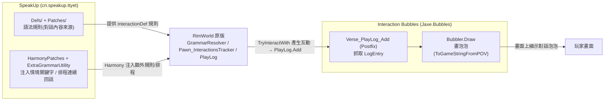

# SpeakUp 架構總覽（00_overview）

> 目標導向：在此基礎上做**擴充（extension）**。本文釐清「是什麼／相依鏈／原始碼分佈／運作機制總圖」。

## 1. 一句話定位

SpeakUp 是一個**純本地、語法規則驅動（grammar-based）**的動態對話系統。它**不串接任何外部 LLM / API、不發任何網路請求**。對話文字全部來自 mod 自帶的 RimWorld `GrammarResolver` 規則（XML `Defs/` + `Patches/`），由 SpeakUp 在語法解析時注入「情境關鍵字」（天氣、心情、想法、技能、關係、工作、傷病…），再由原版互動系統產生 log 文字。顯示泡泡這一段**由相依的 Interaction Bubbles 負責**，SpeakUp 與 Bubbles 之間**沒有直接 API 呼叫**，靠 RimWorld 原版的 `PlayLog`（互動日誌）解耦。

關鍵佐證：
- 注入情境變數而非生成內容：`SpeakUp/ExtraGrammarUtility.cs::ExtraRules`（`SpeakUp/ExtraGrammarUtility.cs:54`）
- 切入點是原版語法解析：`SpeakUp/HarmonyPatches/GrammarResolver_Resolve.cs:15`（只在 `rootKeyword == "r_logentry"` 時注入）
- 全 codebase 無 `HttpClient`/`WebRequest`/`UnityWebRequest`/API key 等字樣（已檢視全部 `.cs`）。

## 2. 相依鏈（SpeakUp ↔ Bubbles）

要點：SpeakUp **不知道 Bubbles 存在**（程式碼層面零引用）。兩者透過原版 `Verse.PlayLog`（互動日誌）這個共用通道串接——SpeakUp 讓 pawn 真的去做一次互動（`TryInteractWith`），互動文字進入 PlayLog，Bubbles 的 `PlayLog.Add` Postfix 攔到後把它畫成泡泡。沒有 Bubbles 時，SpeakUp 仍會在 pawn 的社交日誌面板產生對話，只是不會有畫面泡泡。

## 3. 原始碼 / 組件分佈表

| 區塊 | 路徑 | 角色 |
|---|---|---|
| C# 入口 / 設定 | `SpeakUp/Settings.cs::SpeakUpMod`（`SpeakUp/Settings.cs:9`） | `Mod` 子類；建構時 `new Harmony("jpt.speakup").PatchAll()` 套用全部 patch |
| 對話排程核心 | `SpeakUp/DialogManager.cs`（`:8`） | 靜態狀態機：暫存 Initiator/Recipient、排程 `Statement`、追蹤 `Talk`、`FireStatement` 真正發起互動 |
| 一次對話會話 | `SpeakUp/Talk.cs::Talk`（`:8`） | 一段多輪對話；`Reply` 依 tag 找下一個 `InteractionDef`、`MakeReply` 排下一句 |
| 單句排程資料 | `SpeakUp/Statement.cs::Statement`（`:6`） | 純資料：誰對誰、何時、哪個 InteractionDef、第幾輪 |
| 情境關鍵字產生器 | `SpeakUp/ExtraGrammarUtility.cs::ExtraRules`（`:54`） | **對話「情境」的真正來源**：把 pawn/地圖/時間狀態轉成 `Rule_String` 餵進語法 |
| Harmony patches | `SpeakUp/HarmonyPatches/*.cs`（8 個） | 見下表 |
| 對話內容（資料層） | `1.6/Defs/*.xml` | 定義 `InteractionDef`（含 `SpeakUpReply` 抽象父）與其語法規則 |
| 對話內容（注入既有互動） | `1.6/Patches/*.xml` | 用 `PatchOperationAdd/Replace` 把規則塞進原版 `Chitchat`、`Insult` 等 InteractionDef |
| 編譯產物 | `1.6/Assemblies/SpeakUp.dll` | 不需用到（有源碼） |
| Bubbles 反編譯 | `/home/lorkhan/repo/pas/projects/rimworld_mods/interaction-bubbles/decompiled/Bubbles.decompiled.cs` | 相依端 |

### Harmony Patch 一覽（全部在 `SpeakUp/HarmonyPatches/`）

| 檔案 | 目標方法 | 類型 | 職責 |
|---|---|---|---|
| `Pawn_InteractionsTracker_TryInteractWith.cs:10` | `Pawn_InteractionsTracker.TryInteractWith` | Prefix | 開啟 talkBack 旗標、verbose log |
| `PlayLogEntry_Interaction_ToGameStringFromPOV_Worker.cs:10` | `PlayLogEntry_Interaction.ToGameStringFromPOV_Worker` | Prefix/Postfix | **把當前 Initiator/Recipient/intDef 暫存到 DialogManager**（情境注入靠它）；結束時清空 |
| `GrammarResolver_Resolve.cs:10` | `GrammarResolver.Resolve` | Prefix | 僅對 `r_logentry`：把 `ExtraRules()` 注入 request；可選強制不翻譯 |
| `GrammarResolver_RandomPossiblyResolvableEntry.cs:11` | `GrammarResolver.RandomPossiblyResolvableEntry` | Prefix/Postfix | 暴露當前 rules/constants 供約束驗證；偵測無效關鍵字 |
| `RuleEntry_ValidateConstantConstraints.cs:11` | `GrammarResolver.RuleEntry.ValidateConstantConstraints` | Prefix（取代） | **擴充約束判斷**：支援 `==,!=,<,>,<=,>=` 比對 SpeakUp 注入的情境變數 |
| `GrammarResolver_TryResolveRecursive.cs:9` | `GrammarResolver.TryResolveRecursive` | Prefix/Postfix | 解析 tag、命中 `r_logentry` 後 `Ensue(resolvedTags)` 觸發回話 |
| `Pawn_InteractionsTracker_InteractionsTrackerTick.cs:10` | `Pawn_InteractionsTracker.InteractionsTrackerTick` | Postfix | 每 tick 檢查排程 Statement 是否到點 → `FireStatement` |
| `TickManager_DoSingleTick.cs:9` | `TickManager.DoSingleTick` | Postfix | 每秒清理過期 `Talk` |

## 4. 與 Bubbles 的接點（相依端）

- Bubbles 唯一抓文字的入口：`Verse_PlayLog_Add.Postfix`（`interaction-bubbles/decompiled/Bubbles.decompiled.cs:1100`）→ `Bubbler.Add(entry)`。
- 取出 Initiator/Recipient（反射）後存進 `Bubbler.Dictionary`，繪製時呼叫 `Entry.ToGameStringFromPOV(pawn)` 取得最終文字（`Bubbles.decompiled.cs:444`）。
- **結論**：擴充顯示樣式只能改 Bubbles 端（或另寫 patch）；擴充對話內容只需動 SpeakUp 端，泡泡會自動跟著變，因為它只是讀同一條 PlayLog 文字。

詳細管線見 `01_dialogue_pipeline.md`；擴充接點見 `../details/extension_points.md`。
