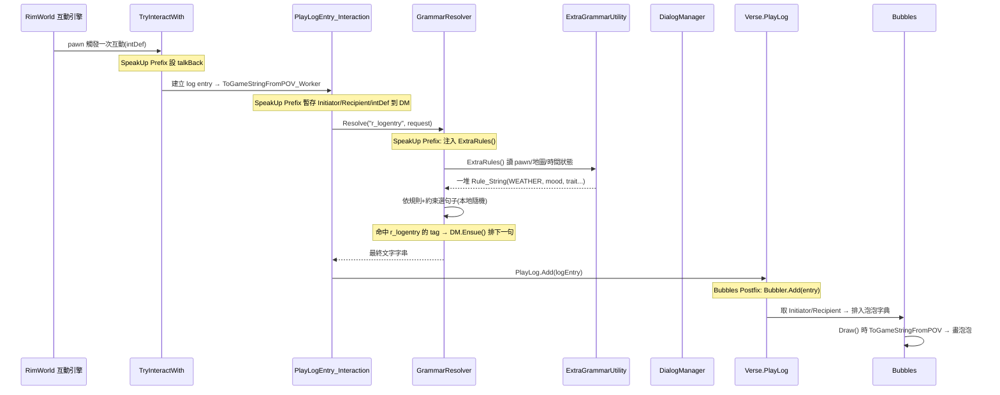

# 對話管線（01_dialogue_pipeline）

> 一句對話從「觸發 → 產生內容 → 經 Bubbles 顯示」的完整路徑，標出每個接點 path:line。
> 結論先講：**內容 100% 來自本地語法規則，無 LLM/API**。

## 0. 全景圖

## 1. 觸發（誰開始說話）

SpeakUp **不自己決定 pawn 何時閒聊**——它沿用 RimWorld 原版社交互動排程（`Pawn_InteractionsTracker` 每 tick 嘗試 `TryInteractWith`，挑一個 `InteractionDef` 如 `Chitchat`/`Insult`）。SpeakUp 只在兩處掛鉤：

- 互動開始：`Pawn_InteractionsTracker_TryInteractWith.cs:13`（Prefix）設 `talkBack=true`。
- **連續回話（多輪）由 SpeakUp 自己排程**：`Pawn_InteractionsTracker_InteractionsTrackerTick.cs:12`（Postfix）每 tick 檢查 `DialogManager.Scheduled` 是否有到點的 `Statement`，到點就 `FireStatement`（`DialogManager.cs:36`）→ 對 receiver 再呼叫一次 `TryInteractWith`，形成你來我往。

排程的源頭：語法解析命中帶 tag 的 `r_logentry` 時，`GrammarResolver_TryResolveRecursive.cs:25` Postfix 呼叫 `DialogManager.Ensue(resolvedTags)`（`DialogManager.cs:16`）→ `Talk.Reply(tag)`（`Talk.cs:45`）→ 用 tag 當 defName 找下一個 `InteractionDef`（`Talk.cs:51`）→ `MakeReply` 排一筆 `Statement`（`Talk.cs:42`）。
- 每段對話輪數上限 `SpeakUpSettings.linesPerConversation`（預設 3，`Settings.cs:59`）。
- 句間間隔 `ticksBetweenLines`（預設 60 tick，`Settings.cs:60`）。
- `sameRegionRestriction`：不同房間不續話（`Talk.cs:47`）。

## 2. 產生內容（文字從哪來——關鍵）

**內容來源＝本地 `GrammarResolver` + mod 自帶 XML 規則。** 流程：

1. 原版要把互動轉成日誌字串時走 `PlayLogEntry_Interaction.ToGameStringFromPOV_Worker`。SpeakUp 的 Prefix 先把當前互動雙方與 intDef 暫存進 `DialogManager`：`PlayLogEntry_Interaction_ToGameStringFromPOV_Worker.cs:15-19`。
2. 接著呼叫 `GrammarResolver.Resolve("r_logentry", ...)`。SpeakUp Prefix 攔截（只認 `r_logentry`）並注入額外規則：`GrammarResolver_Resolve.cs:17-22`。
3. 額外規則由 `ExtraGrammarUtility.ExtraRules()` 產生（`ExtraGrammarUtility.cs:54`）。它把當下情境轉成 `Rule_String` 關鍵字，例如：
   - 心情 `INITIATOR_mood`、想法 `INITIATOR_thoughtDefName`、特質 `INITIATOR_trait`（`ExtraGrammarUtility.cs:85-141`）
   - 關係/好感 `INITIATOR_opinion`、`INITIATOR_relationship`（`:106-132`）
   - 技能/熱情、工作 `INITIATOR_jobDefName`、`INITIATOR_jobText`（`:145-176`）
   - 穿戴/物品/傷病（`:184-234`）
   - 地圖：`WEATHER`、`TEMPERATURE`、`OUTDOORS`、`NEAREST_art/plant`（`:246-267`）
   - 時間：`HOUR`、`DAYPERIOD`（`:269-273`）
4. XML 規則（`1.6/Defs/*.xml` 與 `1.6/Patches/*.xml`）用這些關鍵字當**約束**挑句子。範例：`1.6/Patches/z_add_chitchat_weather.xml:8` `r_logentry(WEATHER==晴)->[weather_clear]`，再依 `TEMPERATURE`、`OUTDOORS`、`INITIATOR_mood` 層層細分。
5. SpeakUp 擴充了約束比對能力：原版 constant 只支援字串相等，SpeakUp 的 `RuleEntry_ValidateConstantConstraints.cs:43` 改成支援數值 `<,>,<=,>=` 與 `==,!=`，這樣 `TEMPERATURE>=-10` 之類才有效。
6. 解析結果是一句**已決定好的本地字串**，回傳給 log entry。

> 對話內容的「資料 vs 程式」分界：
> - **句子文字本身**全在 XML（`Defs/` 定義新 InteractionDef，`Patches/` 把規則塞進原版 Chitchat/Insult/Romance…）。
> - **可用的情境關鍵字集合**由 `ExtraGrammarUtility.cs` 程式碼決定（要新增一種情境變數＝改碼）。

## 3. 顯示（Bubbles）

1. 互動完成後文字進 `Verse.PlayLog`（原版）。Bubbles Postfix `Verse_PlayLog_Add`（`interaction-bubbles/decompiled/Bubbles.decompiled.cs:1100`）呼叫 `Bubbler.Add(entry)`。
2. `Bubbler.Add`（`Bubbles.decompiled.cs:529`）：判斷 entry 是 `PlayLogEntry_Interaction`/`...SinglePawn`，反射取 Initiator/Recipient，過濾（玩家陣營/聽力/動物/徵召等設定），存入 `Dictionary[pawn]`。
3. `Bubbler.Draw`（`Bubbles.decompiled.cs:638`）每幀繪製；每個 `Bubble.GetText` 呼叫 `Entry.ToGameStringFromPOV(pawn)`（`Bubbles.decompiled.cs:444`）取得**和社交日誌相同**的文字。

→ 因此 SpeakUp 改了對話文字，泡泡會自動同步（同一條 PlayLog 文字）。要改泡泡外觀/過濾/位置只能動 Bubbles 端。

## 4. 接點速查表（path:line）

| 階段 | 接點 | path:line |
|---|---|---|
| 觸發-首句 | 原版 `TryInteractWith`（SpeakUp Prefix） | `SpeakUp/HarmonyPatches/Pawn_InteractionsTracker_TryInteractWith.cs:13` |
| 觸發-續句排程 | `DialogManager.Ensue` ← `TryResolveRecursive` Postfix | `SpeakUp/HarmonyPatches/GrammarResolver_TryResolveRecursive.cs:25` / `SpeakUp/DialogManager.cs:16` |
| 觸發-續句發射 | `InteractionsTrackerTick` Postfix → `FireStatement` | `SpeakUp/HarmonyPatches/Pawn_InteractionsTracker_InteractionsTrackerTick.cs:23` / `SpeakUp/DialogManager.cs:36` |
| 內容-暫存雙方 | `ToGameStringFromPOV_Worker` Prefix | `SpeakUp/HarmonyPatches/PlayLogEntry_Interaction_ToGameStringFromPOV_Worker.cs:15` |
| 內容-注入規則 | `GrammarResolver.Resolve` Prefix | `SpeakUp/HarmonyPatches/GrammarResolver_Resolve.cs:20` |
| 內容-情境變數產生 | `ExtraGrammarUtility.ExtraRules` | `SpeakUp/ExtraGrammarUtility.cs:54` |
| 內容-約束比對擴充 | `ValidateConstantConstraints` Prefix | `SpeakUp/HarmonyPatches/RuleEntry_ValidateConstantConstraints.cs:43` |
| 內容-句子資料 | Defs/Patches XML | `1.6/Defs/*.xml`、`1.6/Patches/*.xml` |
| 顯示-抓文字 | Bubbles `PlayLog.Add` Postfix | `interaction-bubbles/decompiled/Bubbles.decompiled.cs:1100` |
| 顯示-繪製文字 | Bubbles `Bubble.GetText` | `interaction-bubbles/decompiled/Bubbles.decompiled.cs:444` |
