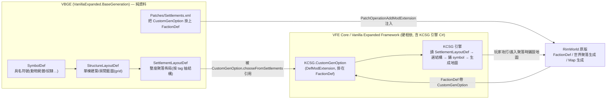
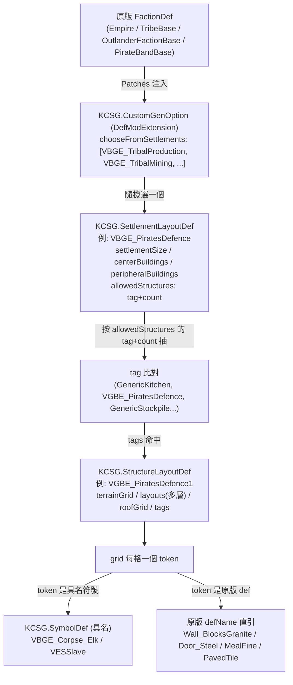

# VBGE 架構總覽（00_overview）

> 目標導向：在此基礎上做 **create（自製聚落生成藍圖／擴充）**。本文釐清「是什麼／相依鏈／資料分佈／生成資料層級總圖」。

## 1. 一句話定位

**Vanilla Base Generation Expanded（VBGE）是一個純資料 mod（無 .cs/.dll），它提供一整套「預先設計好的建築藍圖」（SymbolDef / StructureLayoutDef / SettlementLayoutDef）給相依的 VFE Core 內建的 KCSG 引擎，讓世界地圖上各派系（部落／野民／海盜／帝國）的聚落在玩家進入時，從這個藍圖庫裡程序化拼裝出長得像真正規劃過的村落、城鎮與大型基地，取代原版千篇一律的「20 花崗岩門堡壘方塊」。**

關鍵佐證：
- 全 mod **零 `.cs`／零 `.dll`**，只有 `1.6/Defs/`（藍圖資料）＋ `1.6/Patches/Settlements.xml`（掛接）。引擎完全在相依方提供。
- 唯一硬相依：`OskarPotocki.VanillaFactionsExpanded.Core`（VFE Core / Vanilla Expanded Framework）——見 `About/About.xml:17-23` 的 `<modDependencies>`，且 `<loadAfter>` 同一 packageId（`About/About.xml:24-26`）。
- 所有 def 的 type 前綴皆為 `KCSG.*`（`KCSG.SymbolDef`、`KCSG.StructureLayoutDef`、`KCSG.SettlementLayoutDef`、`KCSG.CustomGenOption`）——KCSG ＝ **K**ikohi **C**ustom **S**tructure **G**eneration，是 VFE Core 內的結構生成命名空間。

> 交叉參照：本分析群組另有 `vanilla-outposts-expanded`（VOE），同屬 Vanilla Expanded 生態、引擎一樣落在 VFE Core 相關 DLL（VOE 用 Outposts.dll，VBGE 用 KCSG）。本文不展開 VOE。

## 2. 相依鏈（VBGE → VFE Core / KCSG）

要點：VBGE **不知道也不呼叫任何 C#**，它只是「填資料」。引擎（讀資料、選結構、鋪 symbol、生 pawn／物資）全在 VFE Core 的 KCSG 命名空間（**引擎屬 VFE Core / 待驗證內部細節**）。VBGE 與引擎的唯一契約是 def 的 XML schema（欄位名稱要對得上 KCSG 的反序列化類別）。

## 3. 資料 / 組件分佈表

素材根：`/home/lorkhan/.local/share/Steam/steamapps/workshop/content/294100/3209927822`（純資料，無反編譯）

| 區塊 | 路徑 | 角色 |
|---|---|---|
| Mod 中繼資料 / 相依宣告 | `About/About.xml` | packageId `VanillaExpanded.BaseGeneration`；硬相依 VFE Core（`:17-23`） |
| **聚落佈局層**（最上層） | `1.6/Defs/SettlementDefs/{Empire,Outlanders,Pirates,Tribals}.xml` | `KCSG.SettlementLayoutDef`：定義一座聚落的尺寸、中心區／外圍區各放哪些 tag 的結構、防禦倍率、倉庫填充物。每派系含 1 個 `Abstract` 父 + 數個 specialisation 子（Production/Mining/Slavery/Logging/Defence…）。共 **21 個** SettlementLayoutDef（含 abstract） |
| **結構藍圖層**（中層, 派系特化） | `1.6/Defs/LayoutDefs/Specialisations/VGBE_*.xml`（7 檔） | `KCSG.StructureLayoutDef`：各派系專屬主建築（如 `VGBE_PiratesDefence` 碉堡、`VGBE_Slavery`） |
| **結構藍圖層**（中層, 通用） | `1.6/Defs/LayoutDefs/GenericLayouts/Generic*.xml`（14 檔） | `KCSG.StructureLayoutDef`：跨派系共用的功能房（廚房/牢房/發電/床房/田地/醫院…），tag 為 `Generic*` |
| **結構藍圖層**（中層, 中心地標） | `1.6/Defs/LayoutDefs/{Empire,Tribals,VGBE_CentralEmpire,VGBE_TribalCenter}.xml` | 派系中心建築（帝國王座/部落中心等） |
| **符號層**（最底層, 具名） | 散落在上述 LayoutDefs（如 `GenericKitchen.xml:405`、`GenericProduction.xml:503/509`、`GenericPrison.xml:3`） | `KCSG.SymbolDef`：替「無法用 thing/terrain defName 直接表達」的東西（動物屍體 `VBGE_Corpse_Elk`、奴隸 `VESSlave`）取一個短代號，供 grid 引用 |
| **掛接層** | `1.6/Patches/Settlements.xml` | `PatchOperationAddModExtension` 把 `KCSG.CustomGenOption` 注入原版/Royalty 的 4 個 FactionDef（Empire/TribeBase/OutlanderFactionBase/PirateBandBase） |
| 編譯產物 | （無） | VBGE 沒有 Assemblies 目錄 |
| 引擎（相依方） | VFE Core 的 KCSG.* C# 類別 | 不在本 mod；反序列化 def、執行生成。**待驗證內部細節** |

> 全 mod 統計：StructureLayoutDef 約 **317 個**（grep 計 `</KCSG.StructureLayoutDef>` 標籤 634 / 2）、SettlementLayoutDef **21 個**、SymbolDef 僅約 12 個（多數 grid 直接用原版 thing/terrain defName，不需具名 symbol）。

## 4. 生成資料層級總圖（KCSG 三層 + 掛接）

逐層細節見 `01_kcsg_data_model.md`；擴充接點見 `../details/extension_points.md`；動手教學見 `../tutorial/01_add_settlement_layout.md`。
