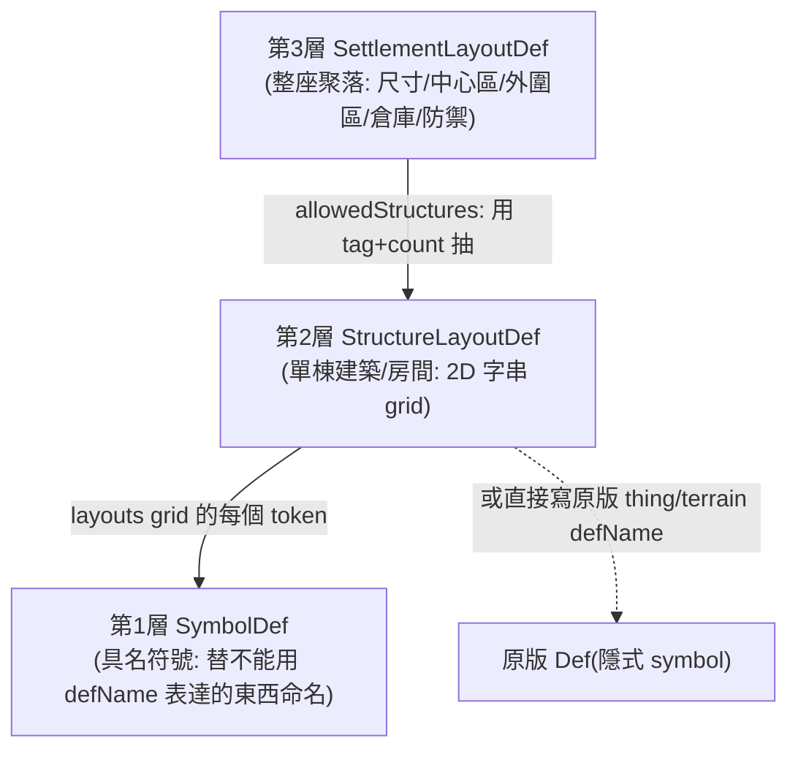

# KCSG 三層資料模型（01_kcsg_data_model）

> 用真實 def 逐層拆：**SymbolDef（符號）→ StructureLayoutDef（單棟結構）→ SettlementLayoutDef（整座聚落）**。三者靠「**tag 字串**」與「**grid token**」鬆耦合，沒有硬引用 defName 的層層巢狀。



---

## 第 1 層：`KCSG.SymbolDef` — 具名符號

最小單位。一個 SymbolDef 給「一格地圖內容」取一個短代號，讓上層 grid 用字串引用。

實例（`1.6/Defs/LayoutDefs/GenericLayouts/GenericKitchen.xml:405`）：
```xml
<KCSG.SymbolDef>
  <defName>VBGE_Corpse_Elk</defName>   <!-- grid 裡寫 VBGE_Corpse_Elk 就生一具麋鹿屍體 -->
  <pawnKindDef>Elk</pawnKindDef>
  <numberToSpawn>1</numberToSpawn>
  <spawnDead>true</spawnDead>
</KCSG.SymbolDef>
```

奴隸符號（`1.6/Defs/LayoutDefs/GenericLayouts/GenericPrison.xml:3`）：
```xml
<KCSG.SymbolDef>
  <defName>VESSlave</defName>
  <pawnKindDef>Slave</pawnKindDef>
  <isSlave>true</isSlave>
</KCSG.SymbolDef>
```

關鍵觀念 — **隱式 symbol**：KCSG 並不強制每個 grid token 都對應一個 SymbolDef。絕大多數 token 直接寫**原版 thing/terrain 的 defName**（`Wall_BlocksGranite`、`Door_Steel`、`MealFine`、`PavedTile`、`Sandbags_Cloth`、`DiningChair_Steel_East`…），引擎自動把它當成「放這個 Thing / 鋪這個 Terrain」。SymbolDef 只在「需要額外旗標」時才用——例如要生一具**屍體**（`spawnDead`）、生一個**奴隸 pawn**（`isSlave`）、或帶旋轉/材質等參數。所以全 mod 只有約 12 個 SymbolDef，卻有上百個結構藍圖。
（帶方向後綴的 token 如 `Cooler_South`、`Shelf_WoodLog_North`、`CommsConsole_East` 是「defName_Rotation」寫法，由引擎解析旋轉——**屬 KCSG 引擎慣例 / 待驗證**。）

---

## 第 2 層：`KCSG.StructureLayoutDef` — 單棟建築 / 房間藍圖

一個 StructureLayoutDef ＝「一張用 2D 字串 grid 畫出來的建築」。核心欄位（實例：`1.6/Defs/LayoutDefs/Specialisations/VGBE_PiratesDefence.xml:3` 的 `VGBE_PiratesDefence1`）：

| 欄位 | 作用 | 範例 |
|---|---|---|
| `defName` | 此結構唯一名 | `VGBE_PiratesDefence1` |
| `terrainGrid` | 地板層：每格一個 terrain defName 或 `.`（不鋪） | `:5-22`，如 `PavedTile,FineTileGranite,.` |
| `layouts` | **建物層（可多層疊放）**：外層 `<li>` 每個是一張完整 grid，逐層套用 | `:23-78`（此例有 3 層：主結構 + 兩層稀疏裝飾/汙物） |
| `roofGrid` | 屋頂層：`1`＝有頂、`.`＝露天 | `:79-96` |
| `tags` | **此結構的分類標籤**（上層聚落用它來抽結構） | `<li>VGBE_PiratesDefence</li>`（`:97-99`） |

grid 讀法：每個 `<li>` 是一列（row），列內以逗號分隔 cell，`.` 表示空格。例（`VGBE_PiratesDefence1` layouts 第一層第二列，`:26`）：
```
Skullspike_Steel,Wall_BlocksGranite,...,Wall_BlocksGranite,Skullspike_WoodLog
```
→ 引擎在對應座標放這些 Thing。`terrainGrid`、`layouts`、`roofGrid` **同一座標系對齊**（同寬同高），分別決定地板/建物/屋頂。

**tag 是耦合關鍵**：同一個 tag 可掛在多個 StructureLayoutDef 上（`VGBE_PiratesDefence1`~`5` 全部 `<tags><li>VGBE_PiratesDefence</li>`）。上層聚落要「一棟海盜碉堡」時只說 tag `VGBE_PiratesDefence`，引擎就從帶此 tag 的所有結構裡隨機抽一個 → 同一派系每次生成都不一樣。

通用功能房同理：所有廚房結構（`VBGEKitchenFreezerSmallDining`、`VBGEKitchenDining`、`VBGE_KitchenAndStock`…，`GenericKitchen.xml:4/52/120/...`）都帶 `<tags><li>GenericKitchen</li>`，被多個派系的聚落共用。

---

## 第 3 層：`KCSG.SettlementLayoutDef` — 整座聚落佈局

最上層：決定一座聚落多大、分幾區、各區放幾棟什麼 tag 的結構、倉庫塞什麼、防禦強度。常用 **abstract 父 + specialisation 子** 繼承。

### Abstract 父（共用骨架）
實例：`VBGE_BaseTribal`（`1.6/Defs/SettlementDefs/Tribals.xml:3`）
```xml
<KCSG.SettlementLayoutDef Abstract="True" Name="VBGE_BaseTribal">
  <settlementSize>72,72</settlementSize>
  <avoidBridgeable>true</avoidBridgeable>
  <avoidMountains>true</avoidMountains>
  <centerBuildings>                       <!-- 中心區 -->
    <centerSize>52,52</centerSize>
    <spaceAround>1</spaceAround>
    <allowedStructures>                    <!-- 每項: 用 tag 抽結構, count 控數量區間 -->
      <li><count>2~10</count><tag>TribalBarrack</tag></li>
      <li><count>1~1</count><tag>TribalKitchen</tag></li>
      <li><count>1~3</count><tag>TribalStockpile</tag></li>
      ...
    </allowedStructures>
  </centerBuildings>
  <peripheralBuildings>                    <!-- 外圍區: 田地等 -->
    <allowedStructures>
      <li><count>2~20</count><tag>GenericField</tag></li>
    </allowedStructures>
  </peripheralBuildings>
  <roadOptions><addLinkRoad>true</addLinkRoad><linkRoadDef>PackedDirt</linkRoadDef></roadOptions>
  <propsOptions><scatterProps>true</scatterProps>...</propsOptions>   <!-- 散落道具(木堆/木桶等) -->
  <stockpileOptions><stockpileValueMultiplier>2.0</stockpileValueMultiplier></stockpileOptions>
</KCSG.SettlementLayoutDef>
```

### Specialisation 子（差異化 + 倉庫填充）
實例：`VBGE_TribalDefence`（`Tribals.xml:172`）繼承 `VBGE_BaseTribal`，用 `Inherit="False"` 整段覆寫 `centerBuildings`、加上 `centralBuildingTags`（中心地標必放）、`defenseOptions.pawnGroupMultiplier`（守軍倍率）、`stockpileOptions.fillWithDefs`（倉庫塞武器）。

海盜實例（`1.6/Defs/SettlementDefs/Pirates.xml:3`，`VBGE_PiratesDefence` 繼承 `VBGE_BaseOutlander`）展示了三個常見子區塊：
- `centerBuildings.allowedStructures`：放 `GenericPower`/`GenericSecurity`/`GenericPodLauncher`/自家 `VGBE_PiratesDefence` 碉堡（`:7-40`）
- `centerBuildings.centralBuildingTags`：必放的地標 tag（`:41-44`）
- `defenseOptions.pawnGroupMultiplier` 1.8（守軍 ×1.8，`:46-48`）
- `stockpileOptions.fillStorageBuildings` + `fillWithDefs`（倉庫塞各式槍械/銀，`:49-69`）

### 三層串起來（海盜 `VBGE_PiratesDefence` 為例）
1. `SettlementLayoutDef VBGE_PiratesDefence` 說中心區要 `2~3` 棟 tag＝`VGBE_PiratesDefence` 的結構（`Pirates.xml:36-39`）。
2. 引擎找出所有 `tags` 含 `VGBE_PiratesDefence` 的 `StructureLayoutDef`（`VGBE_PiratesDefence1`~`5`），隨機抽 2~3 棟。
3. 每棟結構照自己的 `terrainGrid/layouts/roofGrid` 鋪設；grid 內 token 多數是原版 defName（牆/門/家具），少數是 SymbolDef（屍體/奴隸）。

> 引擎「如何把多棟結構排進中心區而不重疊、如何連道路、如何放 props」屬 KCSG C# 的版面演算法——**引擎屬 VFE Core / 待驗證**。資料層只描述「要什麼、幾棟」，不描述「擺在哪個座標」。
