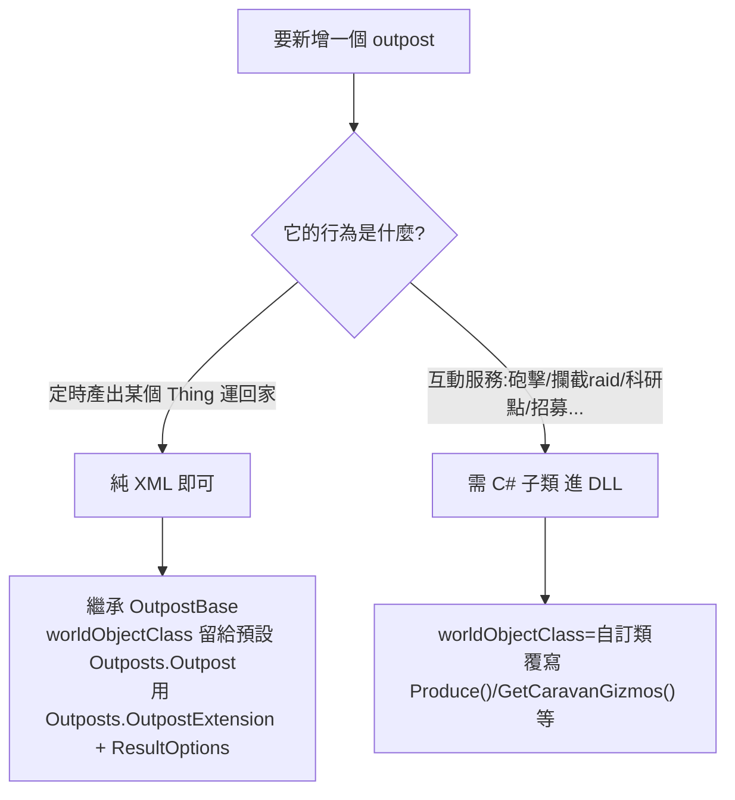

# Vanilla Outposts Expanded (VOE) — 總覽

> 來源 mod：`~/.local/share/Steam/steamapps/workshop/content/294100/2688941031`（Steam Workshop id `2688941031`）
> packageId：`vanillaexpanded.outposts`／作者 legodude17 + Oskar Potocki／支援 1.4 / 1.5 / 1.6

## 是什麼
在世界地圖上組隊建立「自治營地（outpost）」。營地把殖民者放進去，定時自動產出資源並運回主基地，或提供服務（砲擊、防禦攔截、科研、招募）。

## 相依鏈（關鍵）
```
brrainz.harmony                          ← 執行期 patch
OskarPotocki.VanillaFactionsExpanded.Core ← Vanilla Expanded Framework (VEF)，workshop id 2023507013
  └─ 內含 Outposts.dll                    ← outpost「框架引擎」就在這裡，不在 VOE
vanillaexpanded.outposts (本 mod / VOE)   ← 只放「具體 outpost 型別」+ Defs
```

**最容易誤解的一點**：outpost 的核心邏輯（生產／打包／配送／世界物件、`OutpostBase` 抽象 def、`OutpostExtension`）全部在 **VEF 的 `Outposts.dll`**，不在 VOE。VOE 只貢獻具體子類與 XML Def。

## 程式碼分佈（反編譯位置）
| 內容 | DLL | 反編譯產物（在 projects/ 下） |
|---|---|---|
| 框架引擎（`Outposts.Outpost` / `OutpostExtension` / `ResultOption` / `DeliveryMethod` / 4 個 WITab / 建立 gizmo 的 Harmony patch） | `2023507013/1.6/Assemblies/Outposts.dll` | `decompiled-framework/Outposts.decompiled.cs`（4471 行） |
| 具體 outpost（`VOE.Outpost_Artillery/Defensive/Drilling/Encampment/Farming/Hunting/Mining/Scavenging/Science/Town` 等） | `2688941031/1.6/Assemblies/VOE.dll` | `decompiled/VOE.decompiled.cs`（997 行） |
| `OutpostBase` 抽象 WorldObjectDef | — | `2023507013/1.6/Defs/WorldObjectDefs/Base.xml` |
| 各 outpost 的 Def 實例 | — | `2688941031/1.6/Defs/WorldObjectDefs/Outposts.xml` |

## 兩類 outpost（決定「新增需不需要寫 C#」）


- **純 XML 證據**：VOE 的 `Outpost_Logging`、`Outpost_Trading` 完全沒有 `<worldObjectClass>`，只靠 `OutpostExtension` + `ResultOptions` 就能定時產木材／白銀（`Outposts.xml:175,238`）。
- **需 C# 證據**：`Outpost_Artillery`、`Outpost_Defensive`、`Outpost_Science`、`Outpost_Town` 都把 `TicksPerProduction` 設 `-1`（不走生產迴圈），改在 `VOE.dll` 的子類覆寫邏輯。

## 詳見
- 框架生命週期與類別階層 → `architecture/01_framework_lifecycle.md`
- 新增一個 outpost 的完整作法（純 XML） → `tutorial/01_add_outpost_xml.md`
