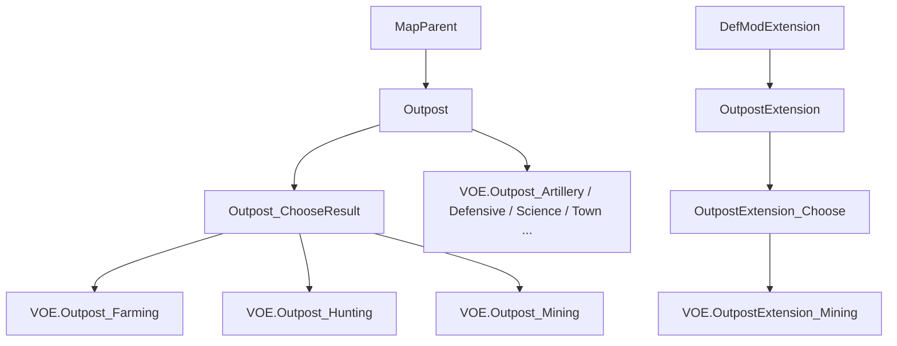
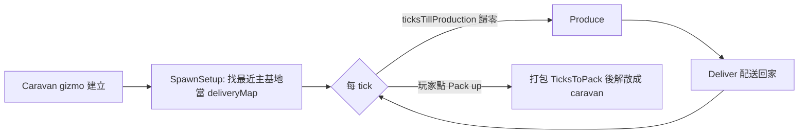

# Outpost 框架生命週期與類別階層

> 來源：`projects/rimworld_mods/vanilla-outposts-expanded/decompiled-framework/Outposts.decompiled.cs`（VEF 的 Outposts.dll）

## 類別階層

- `Outposts.Outpost`（`:731`）＝預設 worldObjectClass，本身就能跑完整生產，**不繼承也能用**。
- `Outpost_ChooseResult`（`:2489`）＝多了「選產出」的下拉，搭 `OutpostExtension_Choose`。

## 生命週期


### 1. 建立（無需任何註冊）
框架用 Harmony patch 掛在 `Caravan.GetGizmos`（`Outposts.decompiled.cs:491` `AddCaravanGizmos`），自動列出**所有** `OutpostBase` 子 def。**新增一個 def 就會自動出現在建立選單**，不用寫註冊碼。
- 建立條件由 `OutpostExtension.CanSpawnOnWithExt(...)` 檢查（`:115`）：`AllowedBiomes`/`DisallowedBiomes`/`RequiredSkills`/`MinPawns`。
- `CostToMake`：建立時消耗的物資（`:2018`）。

### 2. 生產迴圈（`:925 TickInterval` → `:213 Produce`）
- 計時器 `ticksTillProduction`，每滿 `TicksPerProduction` 觸發一次。
- `Produce()`（`:988`）＝ `Deliver(ProducedThings())`。
- `ProducedThings()`（`:983`）＝ `ResultOptions.SelectMany(ro => ro.Make(CapablePawns))`。
- **`TicksPerProduction = -1` → 不生產**（服務型 outpost 用，靠 C# 子類另外做事）。

### 3. 產量公式（`ResultOption.Amount`，`:2058`）
```
amount = ( BaseAmount
         + AmountPerPawn * 在營人數
         + Σ(AmountsPerSkills: 每個技能 Count × 全員該技能等級總和) )
         × Settings.ProductionMultiplier   // mod 設定，預設 1
```
- `MinSkills`：低於此技能門檻的該 ResultOption 不產（用於高階產物，如 spacer 元件需 Crafting 50）。
- 「誰算在營人數」由 `IsCapable(pawn)`（`:1926`）決定：必須是 humanlike、有 skills、且該 outpost 的 `RelevantSkills` 沒有一項被該 pawn 完全禁用。

### 4. 配送（`Deliver`，`:1409`；`DeliveryMethod` enum，`:2466`）
五種：`Teleport`(直接傳送到主基地) / `PackAnimal` / `Store`(留在原地) / `ForcePods`(投送艙) / `PackOrPods`。由 mod 設定 + 每個 outpost 的設定決定，非單一 def 欄位。

### 5. 在營 pawn 的維生
`SatisfyNeeds`（`:1634`）/ `OutpostHealthTick`（`:1703`）：用 `ProvidedFood`（預設 `MealSimple`）餵食、回復休息（`RestPerTickResting`）、緩慢治療。4 個 WITab（Items/Gear/Health/Needs）是檢視 UI。

## 對「新增 outpost」的意義
若你的 outpost 只是「定時產出某 Thing」，以上全部由框架代勞，你只需在 XML 填 `ResultOptions` 與條件欄位。要改變的是**何時觸發 Produce 之外的行為**時，才需要 C# 覆寫 `Produce()` / `GetCaravanGizmos()` / `ProducedThings()`。
