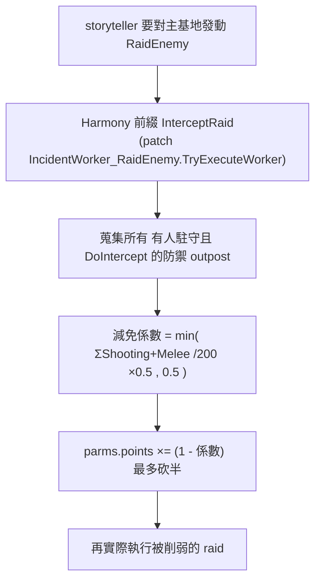

# VOE 的「襲擊事件」設計剖析

> 回答：outpost 會被襲擊嗎？襲擊那塊怎麼設計？
> 依據：`projects/rimworld_mods/vanilla-outposts-expanded/decompiled-framework/Outposts.decompiled.cs`（框架）、`.../decompiled/VOE.decompiled.cs`（具體 outpost）

## 結論（先講重點）
**現行 1.6 程式碼裡，框架不會主動對玩家 outpost 發動襲擊。** outpost 平時是抽象世界物件（`Map == null`），框架 `Outpost.TickInterval`（`Outposts.decompiled.cs:925`）只做三件事：生產、打包、餵食在營 pawn——**沒有任何襲擊生成、地圖生成、或「防守 outpost」的 gizmo**。

VOE Steam 描述寫「outposts can be attacked and you will be forced to defend them」，但這在現行程式碼中**未實作**，屬過時/願景文案。

### 證據
1. **死欄位**：框架 `Outpost` 有 `public float raidPoints;` 與 `public Faction raidFaction;`（`:753,755`），但全檔只在 `ExposeData` 存讀這兩個值（`:890-891`），**程式其他地方完全沒有寫入或讀取** → 殘留欄位（早期設計或被砍的功能）。
2. **無 IncidentWorker**：框架整包唯一的 arrival/incident 類別是 `TransportPodsArrivalAction_AddToOutpost`（`:2580`），沒有任何 `IncidentWorker_*Raid*`、`GetOrGenerateMap`、`alwaysGenerate` 之類觸發。
3. **gizmo 只有 Pack/StopPack**（`:1252,1239`）＋改名/dev——沒有「防守」「進入地圖」按鈕。
4. **原版 storyteller 也打不到**：原版 raid 目標是「有地圖的玩家殖民地」；outpost 平時無地圖，故不會被原版襲擊選中。（理論上因 `Outpost : MapParent`，其他 mod 仍可對該 tile 生成地圖，但 VOE/框架自己不做。）

## 真正被設計好的「襲擊那塊」是**反向的**：對外輸出火力 / 削弱襲擊
VOE 沒有「outpost 被襲擊」，而是做了兩種「用 outpost 影響襲擊」的服務型 outpost。

### 1. `VOE.Outpost_Defensive` — 削弱打主基地的 raid + 投送增援
> `decompiled/VOE.decompiled.cs:339`

- patch 掛載：靜態建構子，只有在「真的存在防禦 outpost def」時才掛（`:366`）。
- `InterceptRaid`（`:383`）：用 `DoRaid` 旗標避免無限遞迴；蒐集 `PawnCount>0 && DoIntercept` 的防禦 outpost，技能總和換算減免，乘進 `parms.points`。
- `GetRaidSizeReductionFactor`（`:400`）：`min(totalSkills/200 * 0.5, 0.5)` — 上限砍 50% raid 點數。
- **Deploy 增援 gizmo**（`:412`）：把駐守 pawn 裝進 `TravellingTransporters` 投送艙，送到 `Range` 內某個有玩家在的地圖支援防守。需求（`ReinforcementsDisabled`，`:497`）：`NeedPods`→ 研究 `TransportPod` 完成、`NeedFuel`→ 有足量 `Chemfuel`、且駐守 ≥2 人。
- 建立條件 `CanSpawnOnWith`（`:371`）：所有 pawn 必須武裝（Shooting 工作未禁用且持有主武器），否則 `Outposts.MustBeArmed`。

### 2. `VOE.Outpost_Artillery` — 對 Range 內目標砲擊
> `decompiled/VOE.decompiled.cs:60`；搭 `Misc.xml` 的 `VOE_TravellingArtilleryStrike` 世界物件。
- 對半徑內目標發射 `TravellingArtilleryStrike`（飛行中的砲擊世界物件），抵達後在目標地圖落彈。一樣是「對外輸出」而非被襲。

## 對「做擴充」的意義
- 想做「**會產出資源的新 outpost**」：純 XML，跟襲擊無關（見 `tutorial/01_add_outpost_xml.md`）。
- 想做「**會被襲擊、要你防守的 outpost**」：這是**框架未提供的全新功能**，需自寫 C#：
  1. 自訂 `IncidentWorker`（或 patch storyteller）依某種累積值（可復活那兩個死欄位 `raidPoints`）對 outpost tile 觸發；
  2. 讓 outpost `GetOrGenerateMap` 生成可防守地圖、生成敵方 pawn、結束後回收地圖；
  3. 配 LetterDef 通知玩家。
  → 規模相當於一個小型獨立功能，不是改 XML 能做到的。可參考原版 `Settlement`/`Site` 的攻防地圖生成。
- 想做「**像防禦 outpost 那樣影響襲擊**」：相對省力，照 `Outpost_Defensive` 的 Harmony patch 範式改係數即可。
