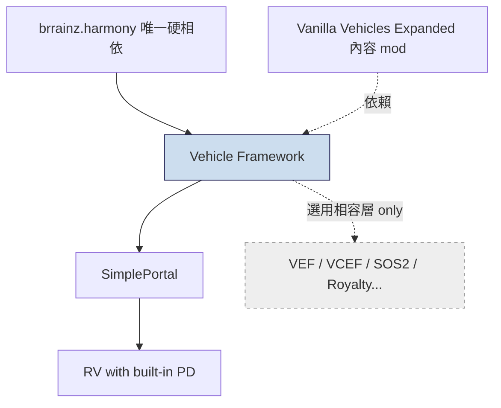
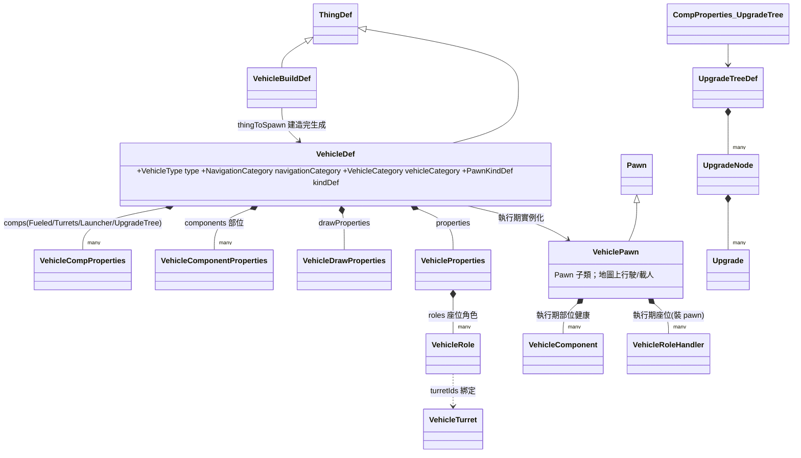

# Vehicle Framework — 架構總覽 (Level 1–2)

## 一句話定位
**Vehicle Framework（Smash Phil）是讓 RimWorld 能造「載具」的大型底層框架**：它把「載具」實作為一種特殊的 `Pawn`（`VehiclePawn : Pawn`），自帶一整套平行尋路系統、座位/角色系統、部位健康系統、砲塔與升級樹，並以 `VehicleDef`（一種 `ThingDef`）作為純 XML 的定義入口。

- packageId：`SmashPhil.VehicleFramework`，modVersion `1.6.2144`，supportedVersions `1.4 / 1.5 / 1.6`
- **發行型態：純 DLL，無官方源碼**（本分析基於 ilspycmd 反編譯）
- **唯一硬相依：Harmony**（`brrainz.harmony`）。About.xml 的 `modDependencies` 只列 Harmony。

## 相依鏈與被依賴關係

本框架在三件套依賴鏈的**最底層**：

- **被依賴**：SimplePortal → RV with built-in PD（已分析）；以及大量內容載具 mod（如 Vanilla Vehicles Expanded）。
- **VEF 關係（重點問題 4）**：**獨立框架，與 VEF 無硬相依**。
  - About.xml 完全沒有提到 VFE Core / VanillaExpanded（`loadAfter` 只有 `brrainz.harmony`）。
  - 反編譯碼中對 `VanillaExpanded.VCEF`（Vanilla Cooking/Fishing）的引用全是**選用相容層**：`Compatibility_VanillaExpandedFishing : ConditionalVehiclePatch`（`Vehicles.decompiled.cs:73663`，`PackageId => "VanillaExpanded.VCEF"`），以及釣魚欄位上的 `[MayRequireAnyOf("ludeon.rimworld.odyssey,VanillaExpanded.VCEF")]`（`:11340`）。沒有 VEF 一樣能運作。
  - 結論：先前「About 的 loadAfter 提到 VFE Core」的前提**不成立**；本框架自帶完整功能，VEF 僅為內容互通的選用增益。

## DLL / Def 組件分佈

| 組件 | 位置 | 職責 |
|---|---|---|
| `Vehicles.dll`（1.8MB，反編譯 90,856 行） | `1.6/Assemblies/` | 框架主體：所有載具型別、尋路、comp、turret、升級、相容層 |
| `SmashTools.dll`（反編譯 29,286 行） | `1.6/Assemblies/` | 通用工具庫：`SimpleDictionary`、`PatternData`、`Trace`、設定 UI（`PostToSettings` 系統）、數學/曲線 |
| `UpdateLogTool.dll` | `1.6/Assemblies/` | 更新日誌彈窗（次要，可略） |
| `VehiclesDefs/` | `1.6/Defs/` | **載具定義最佳教材**：`Base*` 抽象 VehicleDef / VehicleBuildDef / 砲塔 / body / renderTree |
| `PatternDefs/`、`ShaderTypeDefs/` | `1.6/Defs/` | 塗裝 pattern（純 XML）、自訂 shader |
| `ThinkTree/` | `1.6/Defs/` | 載具專用 AI 思考樹（`Vehicle` / `Vehicle_Constant` / Raider） |
| `JobDefs/`、`DutyDefs/`、`WorkGivers/` | `1.6/Defs/` | 載具特有工作（裝卸貨、登/離載具、駕駛） |
| `IncidentDefs/`、`RaidParams/`、`ArrivalModeDefs/`、`Scenarios/` | `1.6/Defs/` | 敵方載具襲擊、空降抵達模式 |
| `Things_Buildings/`、`Things_Skyfallers/`、`Projectiles/` | `1.6/Defs/` | 建造設施、空降載體、砲塔彈藥 |
| `Compatibility/` | `1.6/` | 各 DLC / 知名 mod 的相容層（選用） |

## 核心型別關係

### 重點問題對應的核心結論
1. **載具是不是 Pawn？** 是。`VehiclePawn : Pawn`（`Vehicles.decompiled.cs:13103`）。`VehicleDef : ThingDef`、`category=Pawn`、`thingClass=Vehicles.VehiclePawn`、race 用空 body + 自訂 think tree（`VehiclePawnBase.xml:5,6,99`）。另有 `VehicleBuildDef : ThingDef`（`:5928`）作為「藍圖建築」，建造完才用 `thingToSpawn` 把建築換成 `VehiclePawn`。
2. **如何定義（XML）**：見 `01_vehicle_def_anatomy.md`。
3. **行駛/路徑**：自訂 `VehiclePathingSystem : MapComponent`（`:54564`），每台載具有獨立的 path grid / region / reachability / pathfinder，與原版 pawn 尋路完全分離（載具體積大、地形成本不同）。
4. **VEF 關係**：獨立，僅選用相容層（見上）。
5. **XML vs C#**：見 `details/extension_points.md`、`tutorial/01_add_vehicle_xml.md`。
