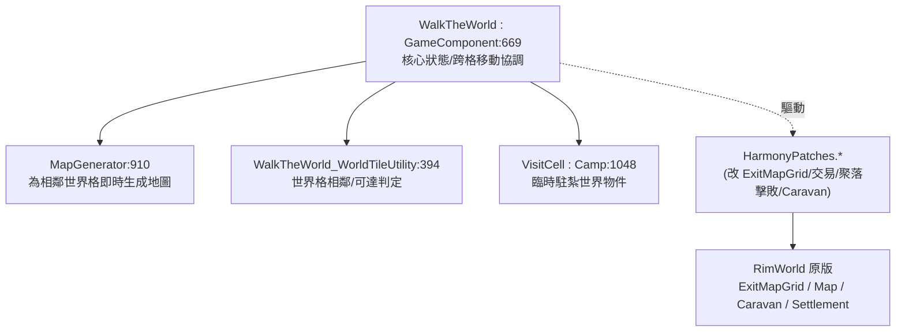

# Walk the World 架構總覽（00_overview）

> 目標導向：analysis→create。核心釐清「純 XML 可做 vs 必須 C#」與擴充接點。

## 1. 一句話定位

`addvans.WalkTheWorld`（workshop 3546716725）讓玩家**把徵召的殖民者走到地圖邊緣，就直接踏入相鄰世界格的地圖**——徒步、無商隊地探索整顆星球，可攻打敵對聚落、拜訪友好聚落交易。**離開地圖後該地圖重置**（地形重生、動物重生）。純 C# 機制 mod（`WalkTheWorld.dll` 1731 行），**無任何自訂 Def**，行為全靠 ModSettings 調整。

## 2. 相依與組件

- 相依：僅 Harmony。無自訂 Def、無 Patches XML。
- 單命名空間 `WalkTheWorld` ＋ `WalkTheWorld.HarmonyPatches`。

## 3. 核心機制

| 型別（行號） | 角色 |
|---|---|
| `WalkTheWorld : GameComponent:669` | 核心：偵測 pawn 走到邊緣、協調「離開當前地圖→進入相鄰格地圖」 |
| `MapGenerator:910` | 為目標相鄰世界格即時生成/取得地圖 |
| `WalkTheWorld_WorldTileUtility:394` | 哪一邊緣對應哪個世界格、可達性 |
| `VisitCell : Camp:1048` | 徒步隊伍在世界地圖上的臨時據點物件 |
| `ExitMapGrid_*_Patch:1188+` | 把**四邊全部設為可離開格**（原版只有特定出口），決定離開顏色/判定 |
| `..._TraderTracker_* / TradeDeal_* Patch` | 徒步拜訪聚落時的交易接管 |
| `SettlementDefeatUtility_CheckDefeated_Patch:1584` | 徒步攻打聚落的擊敗判定 |
| `WalkTheWorldModSettings:58` | 行為旋鈕（`LeavingType` 離開方式 / `RandomEventsFilterType` 途中事件過濾 / `CameraFocusMode` 鏡頭） |

## 4. 結論

行為由 `GameComponent` ＋一組 Harmony patch 驅動，調整全在遊戲內設定 UI（三個 enum）。**沒有資料層（無 Def/無 Patches XML），對外無純 XML 擴充面。** 詳見 `details/extension_points.md`。
