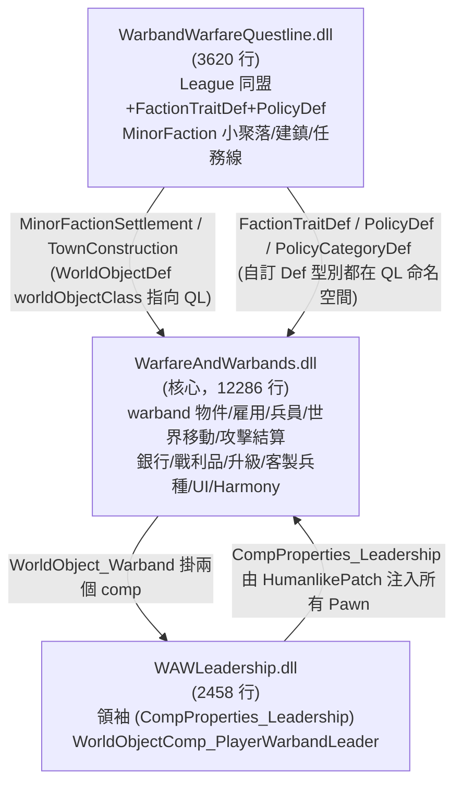
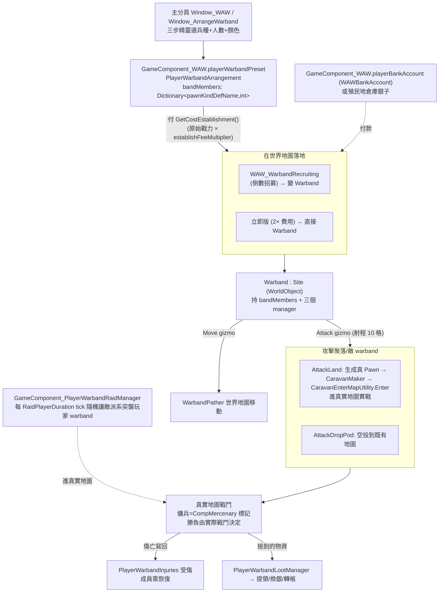

# Warband Warfare — 架構總覽 (核心 DLL：WarfareAndWarbands)

## 一句話定位
**Warband Warfare（packageId `Thumb.Warbands`，Workshop 3371827271，作者 Thumb，1.5/1.6，WIP）** 讓玩家在「世界地圖」上花銀錢雇用、編組、指揮自己的傭兵團（warband）：每個 warband 是一個 `Site` 型的世界物件，記錄「兵種→人數」表；下令攻擊時把這張表**實體化成真正的 Pawn 並進到真實地圖打**，戰利品集中收納、可一鍵提領或轉帳到銀行帳戶。

## 相依鏈
- 硬相依：`brrainz.harmony`（Harmony）。
- `loadAfter`：`brrainz.harmony`、`CETeam.CombatExtended`（CE）。
- `incompatibleWith`：`bs.xenotypespawncontrol`。
- 軟相容（執行期 `ModsConfig.IsActive` 偵測，不是相依）：CombatExtended（彈藥）、VanillaPsycastsExpanded `VPE`、Vehicle Framework `SmashPhil.VehicleFramework`、Better GC `GwinnBleidd.MothballedAndDeadPawns`、HAR（異種族）。

## 三 DLL 分工

- **核心 DLL 自成一格**：warband 的生成、編組、攻擊、戰利品、升級、客製兵種、絕大多數 Harmony patch 都在 `WarfareAndWarbands.dll`。
- **Questline DLL**：提供同盟政治（League）、派系特性、政策、迷你聚落/建鎮，所有自訂 Def 型別（`FactionTraitDef`/`PolicyDef`/`PolicyCategoryDef`）的 C# 類別都在 `WarbandWarfareQuestline` 命名空間（由另一 agent 深究）。
- **Leadership DLL**：領袖系統；核心 DLL 透過 `Warband.playerWarbandManager.leader`（`PlayerWarbandLeader`，定義在核心）與之配合，實際的 `WorldObjectComp_PlayerWarbandLeader` / `CompProperties_Leadership` 在 LD。

## 核心 Def 型別與子系統分類表

| Def 檔 / 型別 | defName | C# 類別（位置） | 子系統 | 性質 |
|---|---|---|---|---|
| `WorldObjects/Worldobject_Warband.xml` `WorldObjectDef` | `WAW_Warband` | `WarfareAndWarbands.Warband.Warband`（DLL:3192） | warband 核心物件 | C# 行為鎖定 |
| 同上 | `WAW_WarbandRecruiting` | `WorldObject_WarbandRecruiting`（DLL:1734） | 招募中（倒數）warband | C# |
| 同上 | `WAW_WarbandVassal` | `…VassalWarband.WorldObject_VassalWarband`（DLL:7426） | 附庸傭兵團 | C# |
| 同上 | `WAW_SettlementConstruction` | `WarbandWarfareQuestline.…TownConstruction` | 建鎮（QL DLL） | C# |
| 同上 | `WAW_MinorFactionSettlement` | `WarbandWarfareQuestline.…MinorFactionSettlement` | 迷你聚落（QL DLL） | C# |
| `Sites/EmptySite.xml` `SitePartDef` | `WAWEmptySite` | 原版 `SitePortWorker` | 玩家 warband 的 site part | **純 XML 可改** |
| `MapGeneration/…xml` `MapGeneratorDef` | `Base_MinorFaction` | 原版＋`GenStep_MinorSettlement`(QL) | 迷你聚落地圖生成 | 半 XML |
| `FactionDefs/Factions_Hidden.xml` `FactionDef` | `WarbandBase`(abstract)/`PlayerWarband` | 原版 FactionDef | 隱藏「玩家傭兵團」派系 | **純 XML** |
| `FactoinTraitDefs/TraitDefs.xml` | `WAW_Cautious`… 10 條 | `WarbandWarfareQuestline.FactionTraitDef` | 派系特性（QL） | **純 XML 資料驅動** |
| `Policies/PolicyCategoryDefs.xml` | `Economy`/`Warfare` | `…League.Policies.PolicyCategoryDef` | 政策分類（QL） | **純 XML** |
| `Policies/PolicyDefs.xml` | `RoadConstruct`… 多條 | `…League.Policies.PolicyDef`(+`workerClass`) | 同盟政策（QL） | **混合**：資料純 XML、效果需 worker C# |
| `JobDefs/Jobs_Work.xml` | `GetInformationFromConsole` / `WAWRecycleVehicle` | `JobGiver_TryGetInformation`(DLL:811) / `JobDriver_RecycleVehicle`(DLL:8928) | 任務驅動 | C# |
| `MainButtonDefs/WAW_MainButton.xml` | `Thumb_WAW` | `WarfareAndWarbands.UI.Window_WAW`(DLL:855) | 主介面分頁（編組預設/戰況） | C# UI |
| `QuestScriptDefs/Script_HelpVillage.xml` | `WAW_SaveVillage` | 原版 QuestScriptDef（空殼） | 任務線占位 | XML |
| `Patches/HumanlikePatch.xml` | — | `CompProperties_Mercenary`(DLL:2427) + `WAWLeadership.CompProperties_Leadership` | 給所有 `thingClass="Pawn"` 注入兩個 comp | XML patch + C# comp |

## 原始碼 / 組件分佈（核心 DLL 命名空間）
- `WarfareAndWarbands`：`GameComponent_WAW`（全域：玩家編組預設 `playerWarbandPreset`、銀行 `playerBankAccount`、派系耐久表）、`WAWSettings`、`WarfareUtil`、`WAWDefof`。
- `WarfareAndWarbands.Warband`：**核心** — `Warband`、`PlayerWarbandArrangement`（編組預設/成本/建立）、`WarbandUtil`（生成/工具/花錢）、`CompMercenary`（每個傭兵 pawn 的 comp）。
- `…Warband.WarbandComponents`：`PlayerWarbandManager`（攻擊/冷卻/受傷/戰利品/領袖/技能/升級 七個子管理器的聚合）、`WarbandPather`（世界移動）、`NPCWarbandManager`。
- `…PlayerWarbandRaid`：`GameComponent_PlayerWarbandRaidManager`（NPC 反過來突襲玩家 warband）。
- `…PlayerWarbandUpgrades`：升級系統（Elite/Engineer/Outpost/Psycaster/Vehicle，**硬編 C# 子類**）。
- `…Mercenary` / `…CharacterCustomization`：傭兵 comp、執行期動態產生客製 `PawnKindDef`（`GameComponent_Customization`）。
- `…UI` / `…Warband.UI`：主分頁、編組三步精靈、戰利品/工程師管理窗。
- `…HarmonyPatches` 等：Harmony 補丁群（見下）。
- 相容層 `Compatibility_VPE` / `Compatibility_Vehicle` / `Compatibility_BetterGC`、`Mercenary.HarmonyPatches`、`CE`/`HAR`。

## warband 核心機制總圖

關鍵結論：**戰鬥不是抽象 points 結算**——`AttackLand` / `RaidPlayer` 都會 `GetOrGenerateMap` 生成真實地圖、把 `bandMembers` 表用 `PawnGenerator` 實體化為 Pawn，再用 `CaravanEnterMapUtility.Enter` / `IncidentDefOf.RaidEnemy` 進場實戰。`points` 只用來決定**敵方**援軍規模，不決定玩家 warband 勝負。
