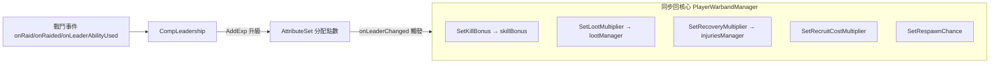
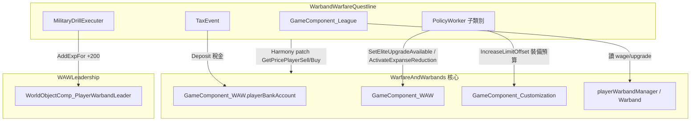

# 02. 兩個擴充 DLL：Questline 與 Leadership

> 本文件分析 Warband Warfare（`Thumb.Warbands`, workshop 3371827271）三個 DLL 中的**兩個擴充 DLL**：
> - `WarbandWarfareQuestline.dll`（劇情/聯盟）
> - `WAWLeadership.dll`（傭兵團領導力）
>
> 核心 `WarfareAndWarbands.dll` 由另一份文件（`00_overview.md` / `01_*.md`）負責，本文僅在「掛接核心」處引用其型別。
>
> 反編譯源：
> - `projects/rimworld_mods/warband-warfare/decompiled/WarbandWarfareQuestline/WarbandWarfareQuestline.decompiled.cs`（3620 行）
> - `projects/rimworld_mods/warband-warfare/decompiled/WAWLeadership/WAWLeadership.decompiled.cs`（2458 行）

---

## 0. 一句話本質

| DLL | 本質 |
|---|---|
| **WarbandWarfareQuestline** | 一個「**諸侯聯盟（League）4X 元層**」：靠 C# 硬編的「救援村莊」任務招募小派系（MinorFaction）加入玩家聯盟，再透過政策樹（PolicyDef）、稅收、道路建設、軍演與「國會投票」管理聯盟。劇情只是入口，主體是聯盟經營。 |
| **WAWLeadership** | 給傭兵團的**指揮官 RPG 系統**：替 pawn 掛 `CompLeadership`，靠戰鬥累積經驗升級，把點數分配到六角形的六種屬性（Commanding/Medic/Recruiting/Engineering/Economy/Diplomacy），屬性再轉成對所屬 warband 的技能加成、戰利品倍率、回復、招募折扣與世界地圖「指揮官技能」互動。 |

---

## 1. WAWLeadership：領導力機制

### 1.1 機制概觀
領導力**不是 PolicyDef、也不是資料驅動**，而是純 C# 硬編的物件模型，掛在 pawn 的 ThingComp 上。

- `CompLeadership : ThingComp`（`WAWLeadership.decompiled.cs:55`）—— 掛在 pawn 上，持有一個 `Leadership` 物件。
- `Leadership`（`:696`）= `LeadershipExp`（經驗/等級）+ `AttributeSet`（六種屬性集合）。
- `LeadershipAttribute`（`:754`）= 一個屬性，`level` 0–3（`maxLevel=3`, `:758`），有 `SkillBonusCurve`（0/2/4/7）。

### 1.2 六種屬性（全部硬編為內部類別，無 Def）
全部繼承 `LeadershipAttribute`，由 `AttributeSet.InitAttributes()`（`:1958`）寫死塞入六個 `new`：

| 屬性類別 | 來源行 | 加成技能(BoostsSkill) | 額外效果 |
|---|---|---|---|
| `Attribute_Commanding`（標籤「Raiding」） | `:2197` | Shooting + Melee | — |
| `Attribute_Medic` | `:2310` | — | 傷患回復倍率（`RecoveryCurve` 1→0.5）；Lv3 可在世界地圖瞬間治療整個 warband |
| `Attribute_Recruiting` | `:2220` | — | 士兵陣亡重生機率（0→0.5）、招募成本折扣（1→0.6） |
| `Attribute_Engineering` | `:2170` | Construction + Mining/Plants | 解鎖 Vehicle/Engineer 升級門檻 |
| `Attribute_Economy` | `:2105` | — | 戰利品價值倍率（0.3→0.55） |
| `Attribute_Diplomacy` | `:2052` | — | Lv2 互動聚落加好感、Lv3 互動和平談判 |

> 屬性 → 技能加成的注入：`AttributeSet.ApplySkillBonuses(PlayerWarbandSkillBonus)`（`:2025`）把每個屬性的 `BoostsSkill()/SkillBonus()` 餵進核心的 `playerWarbandManager.skillBonus`。這是領導力影響戰力的核心通道。

### 1.3 經驗來源（事件監聽）
`CompLeadership` 建構時（`:74`）對核心 `GameComponent_WAW` 的三個 `UnityEvent` 掛監聽：

- `onRaid` → `AddExpForRaiding`（`:87`）
- `onRaided` → `AddExpForDefending`（`:96`）
- `onLeaderAbilityUsed` → `AddExpForUsingAbility`（`:105`）

只有當該 pawn == `GameComponent_WAW.Instance.GetRaidLeaderCache()` 才加經驗。經驗數值來自 `WAWSettings.playerRaidExp` 等（核心的設定）。

### 1.4 屬性 → warband 數值的同步（掛接核心 warband）
`CompLeadership.SelfWarband()`（`:257`）首次取得 warband 時，對核心 `playerWarbandManager.leader.onLeaderChanged` 掛五個監聽，把六種屬性的效果寫回核心 warband 管理器：



對應方法：`SetKillBonus`(`:289`)、`SetLootMultiplier`(`:297`)、`SetRecoveryMultiplier`(`:305`)、`SetRecruitCostMultiplier`(`:313`)、`SetRespawnChance`(`:321`)。

### 1.5 世界地圖「指揮官技能」（主動互動）
`WorldObjectComp_PlayerWarbandLeader : WorldObjectComp`（`:992`）掛在 warband 世界物件上，提供 Gizmo「Interact / Upgrade / Info」（`GetGizmos` `:1011`），冷卻 120000 ticks（2 天）。

互動入口 `InteractionUtility.TryToInteract`（`:397`）依目標型別分派，並以 `ValidateLeader<T>(leader, requiredLevel)`（`:419`）檢查屬性等級門檻：

| 目標 | 需要屬性/等級 | 效果 |
|---|---|---|
| PeaceTalks | Diplomacy ≥3 | 強制和平談判成功、加好感 |
| Settlement | Diplomacy ≥2 | 加 +12 好感 |
| Site（WorkSite_*） | Economy ≥2 | 把 site loot 空投回家 |
| Warband（玩家） | Medic ≥3 | 全體傷患痊癒 |
| DestroyedSettlement | Engineering ≥3 | 花錢蓋新城鎮（`WAW_SettlementConstruction`） |

> 此處與 Questline 的 `TownConstruction` 共用 `WAW_SettlementConstruction` 世界物件（兩邊都有 `GenerateTownConstruction`）。

### 1.6 升級系統（與屬性綁定）
`Window_UpgradeWarband`（`:1645`）列出五個硬編升級 `Upgrade_Outpost/Elite/Engineer/Vehicle/Psycaster`（核心型別），門檻由 `AttributeRequirementSatisfiedFor`（`:1837`）的 `switch` 寫死映射到屬性（如 Elite←Commanding、Vehicle←Engineering）。Elite 還需聯盟政策 `EliteForces` 已執行（`GameComponent_WAW.CanPlayerUseEliteUpgrade()`）。

### 1.7 UI
`ITab_Leadership`（`:1083`，動態 `inspectorTabsResolved.Add`，無 XML）+ `Window_Leadership`（`:1573`）：用 `LeadershipUI.DrawHexagon`（`:1150`）畫六角雷達圖、經驗條、buff 列表與加點按鈕。**全部 C# 即時繪製，無 XML。**

---

## 2. WarbandWarfareQuestline：劇情與聯盟

### 2.1 劇情是「硬編 C# Quest」，不是 QuestScriptDef DSL
**關鍵發現**：唯一的 `QuestScriptDef`（`Defs/QuestScriptDefs/Script_HelpVillage.xml`）只有一個空殼：

```xml
<QuestScriptDef>
  <defName>WAW_SaveVillage</defName>
</QuestScriptDef>
```

它**沒有任何 QuestNode / `<root>` DSL**。Quest 完全用 C# 在 `Quests.GiveVillageQuest()`（`:115`）手動 `new Quest{...}` 組裝：

- `Quests.Generate`（`:89`）：直接 `new Quest{ id=..., root=WAWDefof.WAW_SaveVillage, ... }`——`root` 只當佔位 def 引用，不靠它生成內容。
- 手動 `AddPart` 三個自訂 QuestPart：
  - `QuestPart_WorldObjectTimeout`（村莊到期）
  - `QuestPart_Choice`（含獎勵 `Reward_MinorFactionJoin`）
  - `QuestPart_VillageLooted`（`:162`，自訂 `QuestPartActivable`，每 tick 檢查地圖上是否還有敵人）

任務流程：產一個被敵對派系佔領的 `MinorFactionSettlement`（`GenerateSettlementOccupied` `:3072`）→ 玩家清空敵人 → `FinishQuest`（`:192`）把聚落改為玩家陣營並觸發獎勵 `Reward_MinorFactionJoin.Notify_Used`（`:327`）→ 該小派系 `JoinPlayer()` 並 +20 發展點。

任務的「自動週期投放」由 `QuestEvent : WAWScheduledEvent`（`:1148`，每 30 天 `Quests.GiveVillageQuest()`）驅動。

### 2.2 聯盟（League）核心：`GameComponent_League`
`GameComponent_League : GameComponent`（`:680`）是整個 Questline 的中樞，持有：

- `_minorFactionsSettlements`：玩家聯盟內的小派系聚落清單
- `_policyTree : PolicyTree`、`_taxer : TaxEvent`、`_roadbuilder : RoadBuilder`、`_militaryDrill : MilitaryDrillExecuter`
- `_developmentPoints / _developmentLevel`（升級政策的貨幣）、`_cohesion`（凝聚度）、`_isTradeTreatyActive`

`GameComponentTick`（`:752`）每 `BaseEventGenrationTicks`（約 5 天）跑一次「Grand Tick」：收稅、tick 政策。

### 2.3 政策系統：**這部分是真正資料驅動的**
`PolicyDef : Def`（`:2354`）可純 XML 定義，欄位：`prerequisite`（前置）、`workerClass`（行為類別）、`category`、`taxBonus`、`cost`、`equipmentBudgetLimitOffset`。

- `Defs/Policies/PolicyDefs.xml` 已用 XML 定義 11 個政策，靠 `prerequisite` 串成樹（Economy/Warfare 兩支）。
- `PolicyTree.Refresh()`（`:2437`）從 `DefDatabase<PolicyDef>` 自動讀所有 def 並依 prerequisite 建樹——**新增政策不需改 C#**。
- 選政策走「國會投票」UI：`Window_PolicyCongress`（`:2637`）依各派系 trait 的 `dislikedCategory` 分成 pros/dissenters，玩家拖動左右比例投票；通過後 `Policy.Execute()`（`:2288`）扣錢 + 呼叫 `PolicyDef.Worker.Execute()`。

`PolicyWorker`（`:2523`）是行為基底，預設 `Execute()` 加裝備預算上限。子類別（**必須 C#**）才有特殊副作用，例如：
- `PolicyWorker_TradeAgreement`（`:2616`）→ `GameComponent_League.SetTradeTreaty(true)`（配合 Harmony patch 改交易價，見 §2.6）
- `PolicyWorker_EliteForces`（`:2553`）→ 核心 `SetEliteUpgradeAvailable(true)`
- `PolicyWorker_RoadConstruction`（`:2625`）→ 啟用道路建設
- `PolicyWorker_MilitaryDrills`（`:2584`）→ 啟用軍演
- `PolicyWorker_ResourceOptimization`（`:2593`）→ `playerBankAccount.ActivateExpanseReduction()`
- `PolicyWorker_InfrastructureDevelopment`（`:2562`）→ 每天 +0.01 凝聚度

> 純資料政策（只調 `taxBonus`/`cost`/`equipmentBudgetLimitOffset`，無 workerClass）可純 XML 加；要新副作用就得寫一個 `PolicyWorker` 子類別（C#）。

### 2.4 派系特質：資料驅動
`FactionTraitDef : Def`（`:54`）欄位：`commonality`、`supplyBonus`、`dislikedCategory`（`PolicyCategoryDef`）、`hatedTrait`（`FactionTraitDef`）。`Defs/FactoinTraitDefs/TraitDefs.xml` 已定義 10 個特質。`MinorFactionHelper.GenerateRandomMinorFaction`（`:3140`）用 `DefDatabase<FactionTraitDef>.GetRandom()` 隨機抽——**新增特質純 XML 即可**。

> 注意：`commonality` 欄位存在，但 `GetRandom()` 不依權重抽（均勻隨機）。`supplyBonus` 在反編譯碼中未見被讀取（疑似死欄位/未實作）。

### 2.5 其他聯盟機能（全 C#）
- `RoadBuilder : LeagueComponent`（`:1244`）：在世界地圖選起點/終點，沿 `WorldPath` 用 `Find.WorldGrid.OverlayRoad` 鋪路。
- `MilitaryDrillExecuter`（`:582`）：選一個有指揮官的玩家 warband，給該指揮官 +200 經驗（直接呼叫 `WorldObjectComp_PlayerWarbandLeader.LeadershipInfo.AddExpFor` → **跨 DLL 反向呼叫 Leadership**）。
- `TaxEvent`（`:1158`）：依聯盟內派系 `Tax` 收稅，扣掉 warband wage、加政策 `taxBonus`，存入核心 `GameComponent_WAW.playerBankAccount`。
- `Window_Congress`（`:1454`）/ `Window_KickoutCongress`（`:1933`）：通用國會投票 UI（政策、踢除派系共用）。
- `MinorFactionSettlement : MapParent`（`:3169`）/ `MinorFaction`（`:3470`）：小派系世界物件，可生成 Vassal 傭兵團（`VassalHolder`，核心型別）。

### 2.6 掛接核心 warband 系統的點


Harmony：`HarmonyPatches_League`（`:452`）只 patch 兩個交易價格方法（`TradeUtility.GetPricePlayerSell/Buy`），當 TradeAgreement 啟用時把買賣價拉到市場價。其餘全靠 `GameComponent` tick 與直接呼叫核心公開 API，**沒有大規模 Harmony 介入核心 warband 邏輯**。

---

## 3. 兩個 DLL 對核心的依賴關係（總表）

| 擴充 DLL | 依賴核心型別 | 互動方向 |
|---|---|---|
| Leadership | `GameComponent_WAW`（事件/RaidLeader）、`Warband.playerWarbandManager`(skillBonus/lootManager/injuriesManager/leader/upgradeHolder)、`WarbandUtil`、`PlayerWarbandUpgrade*` | 讀寫核心 warband 數值；被 Questline 反向呼叫加經驗 |
| Questline | `GameComponent_WAW.playerBankAccount`、`GameComponent_Customization`、`VassalHolder`、`WarbandUtil`、`WAWDefof`；並 `using WAWLeadership.WorldObjectComps`（軍演加經驗） | 經營元層，把稅金/解鎖回饋核心；軍演呼叫 Leadership |

> 載入相依：Questline `using WAWLeadership.*`，故 Questline 依賴 Leadership；兩者都依賴核心。三者的關係是「核心 ← Leadership ← Questline」的單向疊加。
