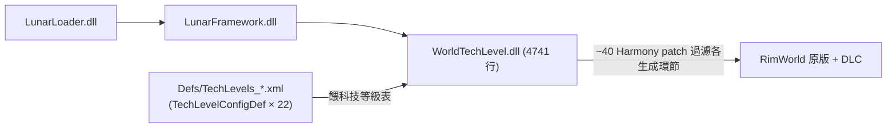

# World Tech Level 架構總覽（00_overview）

> 目標導向：analysis→create。核心釐清「純 XML 可做 vs 必須 C#」與擴充接點。

## 1. 一句話定位

`m00nl1ght.WorldTechLevel`（workshop 3414187030）讓玩家在**建立世界時選一個科技等級上限**，然後**把所有高於該等級的遊戲內容過濾掉**（物品/研究/派系/異種/迷因/背景/事件/地圖生成…），並在可行處以低科技替代物取代。透過 **LunarFramework** 載入（`LunarLoader.dll` + `Lunar/Components/{WorldTechLevel,LunarFramework,HarmonyLib}.dll`）。

**它本質上是一個「內容過濾框架」**，而過濾所需的「哪個 def 算哪個科技等級」這份知識，**全部用純資料 `TechLevelConfigDef` 表達**——因此對下游 mod 極友善：要讓本 mod 認得某內容 mod 的物品/研究，只要加一份純 XML 的 `TechLevelConfigDef`。

## 2. 相依鏈

- 無硬相依（DLC 全 `loadAfter` 選用）；自帶 HarmonyLib（隨 Lunar）。
- 世界選定的等級存在 `GameComponent_TechLevel:415`；預設值由 `ScenPart_WorldTechLevel:439`（場景部件 `Defs/ScenParts.xml`）提供，建立世界頁 `Patch_Page_CreateWorldParams:2980` 加選單。

## 3. 核心型別

| 型別（行號） | 角色 |
|---|---|
| `TechLevelConfigDef : Def:478` | **核心資料 def**：把一批 def 標上科技等級＋替代物＋故事關鍵字過濾（見擴充接點） |
| `DefTechLevels:69` / `TechLevelDatabase<T>:530` | 解析＋快取「每個 def 的有效科技等級」 |
| `TechLevelUtility:1226` / `ResearchUtility:1112` | 等級比較、研究樹過濾 |
| `ReplacementUtility:901` / `BuildingMaterialUtility:759` | 被過濾物 → 低科技替代物（如建材替換） |
| `GameComponent_TechLevel:415` | 持有本局世界的科技等級 |
| `WorldTechLevelSettings : LunarModSettings:1621` | 遊戲內 UI 編輯各 def 的等級歸類（`DefListing<T>`） |
| `WorldTechLevel.Patches.*:2315+` | ~40 個過濾 patch：BaseGen/FactionGenerator/PawnGenerator/MapGenerator/Research/Memes/Ideo/Quest… |

## 4. 運作流程

1. 建立世界時選等級 → 存 `GameComponent_TechLevel`。
2. `TechLevelConfigDef` 把無原生 `techLevel` 欄位的內容（資源、研究、背景故事…）補上等級，建成 `TechLevelDatabase`。
3. 各生成環節的 Harmony patch 查資料庫，**剔除超標內容**，或用 `alternatives` 替代物頂替。
4. 背景故事等純文字內容用 `storyFilters`（關鍵字）推估等級再過濾。

詳見 `details/extension_points.md`。
