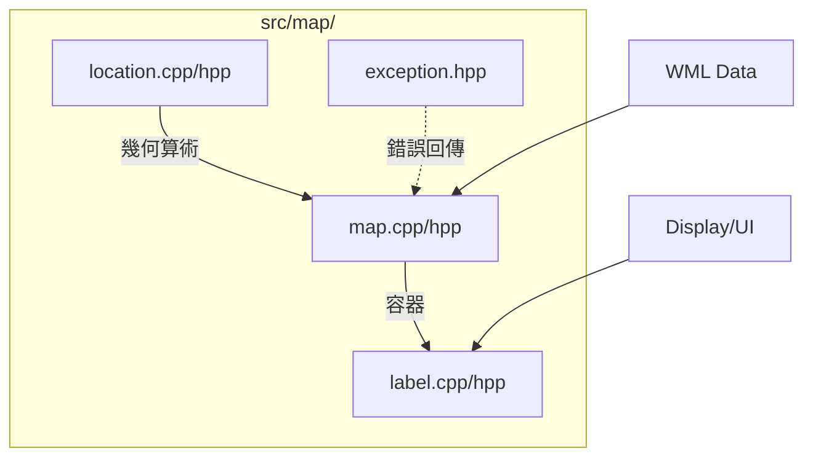

# Wesnoth 技術全典：地圖與標籤系統全檔案解析 (完整工程版)

本卷窮舉並解構 `src/map/` 目錄下的**所有**檔案及函數，提供零死角的工程解剖與調用流程圖。

---

## 1. 目錄級組件交互圖

---

## 2. 檔案解析：`location.cpp` / `location.hpp`
這是在六角格地圖中定位與運算的幾何原語。

- **`cubic_location` (結構體)**：實作三軸坐標系統 ($q+r+s=0$)，用於簡化旋轉邏輯。
- **`map_location::all_directions()`**：回傳基本方向集。
- **`map_location::rotate_direction(d, steps)`**：執行方向旋轉，內含負數求餘的補償邏輯。
- **`map_location::get_relative_dir(loc)`**：計算兩點間的相對方位角。
- **`map_location::get_direction(dir, n)`**：座標偏移計算。
- **`map_location::vector_sum_assign(a)`**：座標向量加法，處理六角格奇偶行 Y 軸錯位。
- **`hash_value(a)`**：空間雜湊函數，用於加速 `std::unordered_map` 查詢。
- **`get_adjacent_tiles(a, res)`**：鄰接拓撲枚舉，填充 6 個相鄰座標。
- **`distance_between(a, b)`**：六角格曼哈頓距離計算。

---

## 3. 檔案解析：`map.cpp` / `map.hpp`
處理地圖矩陣存儲與地形語義。

### 3.1 `gamemap_base` (容器層)
- **`gamemap_base(w, h, t)`**：配置包含 Border 的二維地形緩衝區。
- **`on_board_with_border(loc)`**：全矩陣邊界安全檢查。
- **`overlay(m, loc, rules...)`**：地圖模組疊加演算法。
- **`set_starting_position(side, loc)`**：管理玩家重生點與 AI 領袖坐標。

### 3.2 `gamemap` (語義層)
- **`read(data, allow_invalid)`**：核心解析引擎，將 WML 編譯為 `terrain_code`。
- **`get_terrain_info(loc)`**：關聯地形數據庫，獲取該座標的所有物理屬性。
- **`is_village(loc)` / `is_castle(loc)` / `is_keep(loc)`**：戰略屬性快速判定。
- **`gives_healing(loc)`**：地形醫療量數值檢索。
- **`write()`**：地圖序列化回 WML 字串。

---

## 4. 檔案解析：`label.cpp` / `label.hpp`
處理地圖上的文字標註。

- **`map_labels::add_label(...)`**：在地圖座標上動態實體化一個 `terrain_label`。
- **`map_labels::recalculate_shroud()`**：根據「黑幕」狀態隱藏或顯示標籤。
- **`map_labels::clear_all()`**：清理所有玩家的可視標籤。
- **`terrain_label::viewable(disp)`**：幾何可視性判定，判斷標籤是否位於攝影機視口內。
- **`terrain_label::calculate_shroud()`**：計算單個標籤是否被特定陣營的迷霧覆蓋。

---

## 5. 檔案解析：`exception.hpp`
- **`incorrect_map_format_error`**：定義地圖解析失敗時的異常物件，確保解耦的錯誤回傳機制。
