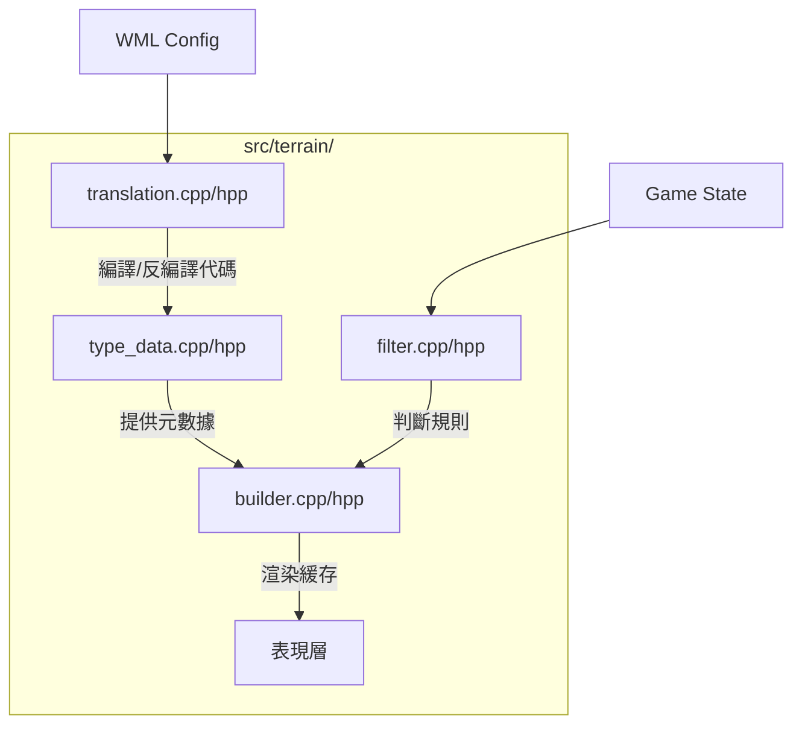

# Wesnoth 技術全典：地形引擎與翻譯層全檔案解析 (完整工程版)

本卷窮舉並解構 `src/terrain/` 目錄下的**所有**檔案及函數，提供零死角的工程解剖與調用流程圖。

---

## 1. 目錄級組件交互圖

---

## 2. 檔案解析：`translation.cpp` / `translation.hpp`
這是地形系統的「編譯器」，將人類可讀的地形字串轉化為機器高效的 `uint32_t`。

- **`terrain_code::terrain_code(b, o)`**：複合地形構造函數（基礎 Base + 覆蓋 Overlay）。
- **`read_terrain_code(str, filler)`**：詞法解析，處理如 `Gg^Ff` 這種 WML 地形表達式。
- **`write_game_map(map, ...)`**：高效矩陣序列化，將整張地圖導出為緊湊的 WML 代碼塊。
- **`string_to_number_(str, ...)`**：核心轉換函數，利用整數編碼實現地形代碼的 $O(1)$ 比較。
- **`read_list(str)`**：解析地形列表，用於處理類似「所有森林地形」的集合操作。

---

## 3. 檔案解析：`type_data.cpp` / `type_data.hpp`
地形元數據管理器。

- **`lazy_initialization()`**：延遲初始化，在第一次訪問地形資訊時才加載龐大的地形配置庫，提升啟動速度。
- **`get_terrain_info(code)`**：根據編譯後的 `terrain_code` 檢索其防禦力、移動成本、動畫列表等完整屬性。
- **`merge_terrains(old_t, new_t, mode)`**：實作地形混合邏輯，例如「將雪地覆蓋到森林上」產生的新地形碼。

---

## 4. 檔案解析：`builder.cpp` / `builder.hpp`
地形規則引擎。

- **`terrain_builder::rotate_rule(...)`**：利用幾何變換，將單一 WML 渲染規則自動複製到全 6 個方向。
- **`terrain_builder::apply_rule(rule, loc)`**：模式匹配（Pattern Matching），檢查 `loc` 及其鄰居是否符合規則約束。
- **`rebuild_cache(tod, log)`**：根據晝夜時間 (TOD) 動態切換地形貼圖。
- **`build_terrains()`**：全局渲染管線，執行所有規則匹配並填充顯示緩存。

---

## 5. 檔案解析：`filter.cpp` / `filter.hpp`
地形過濾系統。

- **`terrain_filter::match_internal(...)`**：複雜條件判定。支援根據坐標、地形類型、甚至周圍單位的狀態來過濾座標。
- **`terrain_filter::get_locs_impl(...)`**：集合運算，回傳地圖上所有符合 WML 過濾條件的座標集合。
- **`terrain_filter_cache`**：緩存過濾結果，避免在同一個回合內重複計算昂貴的地形過濾邏輯。

---

## 6. 其他檔案簡述
- **`terrain.cpp/hpp`**：定義 `terrain_type` 資料結構，封裝防禦力矩陣。
- **`movement.hpp`**：定義與地形相關的移動力屬性介面。
- **`type_data.hpp`**：宣告全域地形查找表。
