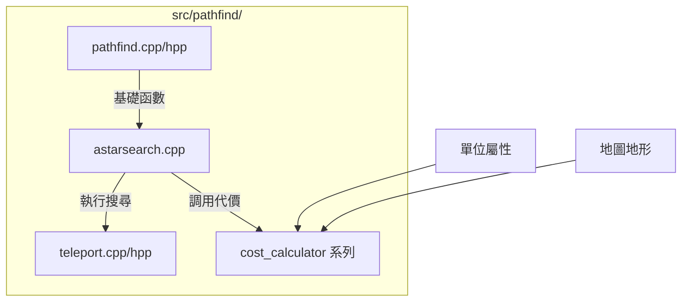

# Wesnoth 技術全典：尋路系統與空間幾何全檔案解析 (完整工程版)

本卷窮舉並解構 `src/pathfind/` 目錄下的**所有**檔案及函數，提供零死角的工程解剖與調用流程圖。

---

## 1. 目錄級組件交互圖

---

## 2. 檔案解析：`astarsearch.cpp`
實作 A* 演算法的核心引擎。

- **`a_star_search(...)`**：
  - **工程實作**：使用 `std::priority_queue` 維護待展開節點。
  - **確定性機制**：透過 `search_counter` 標記節點版本，避免在同一個檔案作用域內重複執行昂貴的矩陣初始化。
  - **拓撲擴展**：整合了六角格鄰接規則與傳送門地圖。

---

## 3. 檔案解析：`pathfind.cpp` / `pathfind.hpp`
定義路徑代價模型與結果容器。

- **`shortest_path_calculator::cost(...)`**：
  - **動態成本**：根據單位移動類型 (`movetype`) 獲取地形代價，並在進入敵方 ZOC 時強制歸零移動力。
- **`full_cost_map::add_unit(...)`**：
  - **熱力圖填充**：計算單位在當前回合的所有可抵達點，並標記抵達所需的最小成本。
- **`paths::dest_vect::contains(loc)`**：
  - **空間檢索**：高效判斷某個坐標是否位於單位的活動範圍內。
- **`jamming_path::jamming_path(...)`**：
  - **視野干擾**：計算特定單位的視野遮蔽範圍，用於更新戰爭迷霧狀態。

---

## 4. 檔案解析：`teleport.cpp` / `teleport.hpp`
管理遊戲中的傳送機制（如隧道、傳送門）。

- **`teleport_group::to_config()`**：
  - **序列化**：將傳送門的起點、終點與過濾條件轉為 WML。
- **`manager::next_unique_id()`**：
  - **唯一性保證**：產生全域唯一的傳送門組識別碼，確保網路同步時不會衝突。
- **`manager::add(group)` / `manager::remove(id)`**：
  - **動態維護**：在遊戲過程中隨時建立或摧毀傳送路徑（如隨機地圖中的隱藏隧道）。
