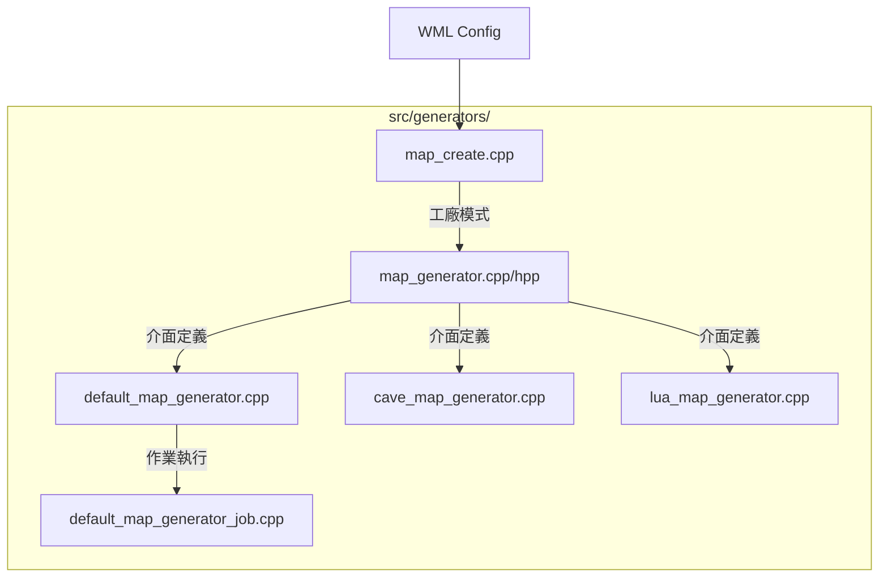

# Wesnoth 技術全典：地圖生成器架構全檔案解析 (完整工程版)

本卷窮舉並解構 `src/generators/` 目錄下的**所有**檔案及函數，提供零死角的工程解剖與調用流程圖。

---

## 1. 目錄級組件交互圖

---

## 2. 檔案解析：`map_generator.cpp` / `map_generator.hpp`
定義地圖生成器的通用行為。

- **`map_generator::create_scenario(seed)`**：虛擬介面，負責產生包含地形與事件的完整遊戲場景。
- **`map_generator::user_config()`**：預設為空，允許子類別實作參數調整介面。

---

## 3. 檔案解析：`default_map_generator.cpp` 與 `default_map_generator_job.cpp`
Wesnoth 的預設生成器實作。

- **`default_map_generator::generate_map(...)`**：
  - **控制邏輯**：建立一個非同步作業 `job` 並執行地圖合成。
- **`default_map_generator_job::generate_height_map(...)`**：
  - **演算法核心**：執行標量場疊加，包含 Bounding Box 優化。
- **`rank_castle_location(...)`**：
  - **空間評分**：計算城堡放置的戰略優劣。

---

## 4. 檔案解析：`cave_map_generator.cpp`
專門生成洞穴地圖的演算法。

- **`cave_map_generator_job::build_chamber(...)`**：
  - **區域生成**：利用隨機侵蝕算法生成不規則的洞穴房間。
- **`cave_map_generator_job::place_passage(...)`**：
  - **隧道挖掘**：利用專用的 `passage_path_calculator` 在房間之間挖掘出走廊。

---

## 5. 檔案解析：`lua_map_generator.cpp`
允許使用 Lua 腳本進行高度自定義的地圖生成。

- **`lua_map_generator::create_map(seed)`**：
  - **腳本調用**：啟動 `mapgen_lua_kernel` 並執行 Lua 回呼函數，將 C++ 的矩陣控制權移交給腳本。

---

## 6. 檔案解析：`map_create.cpp`
生成器的分配中樞。

- **`create_map_generator(name, cfg, vars)`**：
  - **工廠模式**：根據 WML 中的 `id`（如 `default`, `cave`, `lua`）動態創建對應的生成器實體。
- **`random_generate_map(...)`**：
  - **頂層調用**：一鍵產生隨機地形的捷徑函數。
