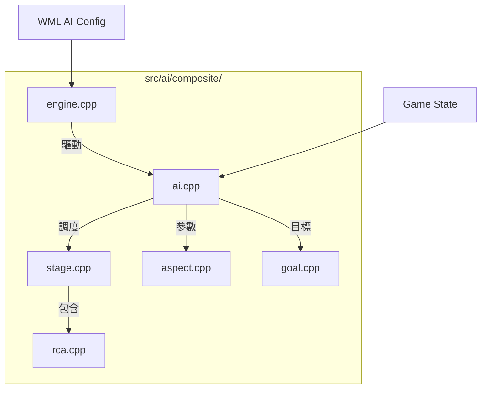

# Wesnoth 技術全典：AI 核心框架全檔案解析 (完整工程版)

本卷窮舉並解構 `src/ai/composite/` 與 `src/ai/` 根目錄下的**所有**檔案及函數。這是 AI 系統的骨幹，負責任務分發與參數管理。

---

## 1. 目錄級組件交互圖

---

## 2. 檔案解析：`ai.cpp` / `ai.hpp`
AI 的中央控制器。

- **`ai_composite::play_turn()`**：
  - **執行序向**：遍歷所有註冊的 `stage`。
  - **狀態同步**：在每個階段結束後執行 `new_turn` 或側翼切換。
- **`ai_composite::preparse_cfg(...)`**：
  - **預處理**：在 AI 實體化前解析 WML 節點，確保 `[aspect]` 與 `[goal]` 的語義正確。
- **`ai_composite::switch_side(side)`**：
  - **陣營遷移**：重置所有 Aspect 緩存，確保 AI 的決策基準點與當前操控陣營同步。

---

## 3. 檔案解析：`aspect.cpp` / `aspect.hpp`
管理 AI 的行為參數（如好戰度、謹慎度）。

- **`aspect::redeploy(cfg, id)`**：
  - **動態更新**：允許在遊戲過程中透過 WML 事件即時修改 AI 的性格參數。
- **`aspect_factory::is_duplicate(name)`**：
  - **單例保證**：防止同一個 AI 實體內註冊多個同名的行為參數，確保數據一致性。

---

## 4. 檔案解析：`engine.cpp` / `engine.hpp`
AI 的實體化引擎。

- **`engine::parse_candidate_action_from_config(...)`**：
  - **物件工廠**：將 WML 中的 `[candidate_action]` 轉化為 C++ 的 `candidate_action_ptr`。
- **`engine::parse_stage_from_config(...)`**：
  - **階段建構**：根據腳本定義，動態插入招募、進攻或自定義的 Lua 階段。

---

## 5. 檔案解析：`rca.cpp` / `rca.hpp`
RCA (Recursive Candidate Action) 的基礎定義。

- **`candidate_action::get_max_score()`**：
  - **最佳化剪枝**：回傳該行動理論上的最高分，幫助 RCA 框架快速跳過當前局勢下無意義的候選者。
- **`candidate_action::is_allowed_unit(u)`**：
  - **權限過濾**：判斷該 AI 動作是否能操控指定的單位。
