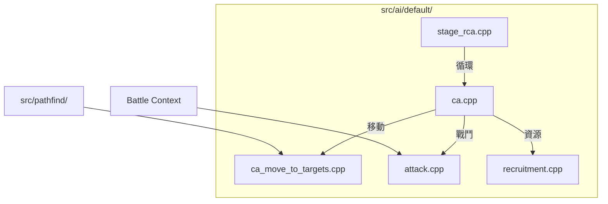

# Wesnoth 技術全典：預設戰術行動全檔案解析 (完整工程版)

本卷窮舉並解構 `src/ai/default/` 目錄下的**所有**檔案及函數。這是 AI 的行為實作層，處理具體的戰場計算。

---

## 1. 目錄級組件交互圖

---

## 2. 檔案解析：`attack.cpp` (戰鬥模擬)
- **`attack_analysis::analyze(...)`**：計算包含經驗值折算的 $V_{target}$。
- **`attack_analysis::rating(...)`**：實作 $Exposure$（風險敞口）與 $Sanity\ Check$ 邏輯。

---

## 3. 檔案解析：`recruitment.cpp` (資源管理)
- **`recruitment::do_combat_analysis(...)`**：建立 $N \times M$ 兵種壓制矩陣。
- **`recruitment::get_estimated_income(...)`**：執行未來 5 回合的財政淨值預測。
- **`recruitment::update_important_hexes()`**：對前線座標進行特徵採樣，主導地形感知的招募。

---

## 4. 檔案解析：`ca_move_to_targets.cpp` (戰略移動)
- **`move_to_targets_phase::rate_group(...)`**：
  - **工程解析**：評估多個單位協同作戰時的綜合防禦力與機動力。
- **`move_to_targets_phase::enemies_along_path(...)`**：
  - **風險預測**：在移動路徑上執行「威脅感應」，若路徑進入敵方 ZOC 或伏擊點，則動態下修行動評分。

---

## 5. 檔案解析：`ca.cpp` (通用行為集)
- **`retreat_phase::should_retreat(...)`**：
  - **工程解析**：根據 `caution` 係數與地形防禦力，判斷受傷單位是否應執行「向後搜尋最近村莊/醫護點」的路徑規劃。
- **`get_villages_phase::dispatch(...)`**：
  - **分配演算法**：利用簡單的貪婪模型 (Greedy Matching)，將最近且空閒的單位分配至無人村莊。

---

## 6. 檔案解析：`stage_rca.cpp` (RCA 循環控制器)
- **`candidate_action_evaluation_loop::do_play_stage()`**：
  - **核心主迴圈**：實作了「評估 -> 排序 -> 執行最高分 -> 狀態更新 -> 遞歸」的完整 RCA 邏輯。
  - **Dirty Flag 處理**：若執行後地圖或單位狀態改變，強制標記所有 CA 緩存失效。
