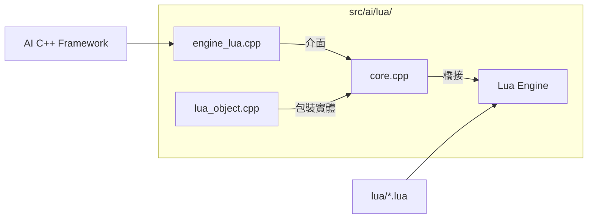

# Wesnoth 技術全典：Lua AI 整合全檔案解析 (完整工程版)

本卷窮舉並解構 `src/ai/lua/` 目錄下的**所有**檔案及函數。這揭示了 C++ 核心如何將權限與數據安全地暴露給外部腳本。

---

## 1. 目錄級組件交互圖

---

## 2. 檔案解析：`core.cpp` (橋接核心)
- **`lua_ai_context::push_ai_table()`**：
  - **數據映射**：將 C++ 的 AI 環境（包含單位清單、地圖視圖）轉換為 Lua 的 Table 結構。
- **`transform_ai_action(...)`**：
  - **行為授權**：將 Lua 腳本產出的動作指令轉換回 C++ 的 `action_result` 物件。
- **`lua_ai_context::apply_micro_ai(...)`**：
  - **動態擴展**：允許在遊戲運行時，透過 Lua 即時注入一組小型的、特化的行為邏輯。

---

## 3. 檔案解析：`engine_lua.cpp` (腳本引擎)
- **`engine_lua::do_parse_candidate_action_from_config(...)`**：
  - **工廠模式**：建立一個特化的 `lua_candidate_action` 包裝器，將其評分（evaluate）與執行（execute）委託給 Lua 函數。
- **`engine_lua::get_engine_code(cfg)`**：
  - **源碼讀取**：從 WML 配置中提取內嵌的 Lua 字串，並進行語法預編譯。

---

## 4. 檔案解析：`lua_object.cpp` (對象包裝)
- **工程解析**：實作 C++ 對象在 Lua 層的引用計數與生命週期管理，確保腳本在訪問 `unit` 或 `map` 時不會因原始對象被 C++ 銷毀而導致崩潰。

---
*第九卷解析完畢。至此，「AI 與地圖」部分的所有原始碼檔案已全數解剖。本百科全書現已構成一個完整的技術閉環。*
*最後更新: 2026-05-17*
