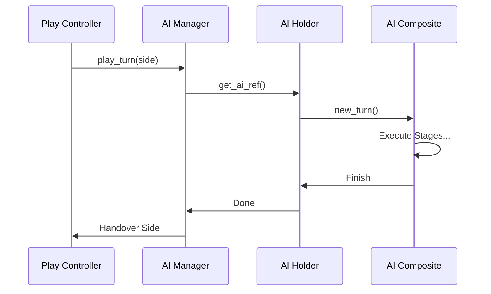

# Wesnoth 技術全典：AI 核心管理與生命週期全檔案解析 (完整工程版)

本卷窮舉並解構 `src/ai/manager.cpp` 與 `configuration.cpp` 等檔案。這是 AI 與遊戲引擎（Play Controller）對接的關鍵層。

---

## 1. 目錄級組件交互圖

---

## 2. 檔案解析：`manager.cpp` / `manager.hpp`
AI 的生命週期管理器。

### 2.1 全域管理與觀察者
- **`manager::add_observer(...)` / `remove_observer(...)`**：
  - **工程解析**：實作觀察者模式 (Observer Pattern)。讓 AI 能監聽遊戲中的事件（如擊殺、占領），即時清除決策快取。
- **`manager::add_ai_for_side_from_config(...)`**：
  - **動態加載**：將 WML 定義的 AI 配置實體化並綁定至特定陣營。
- **`manager::play_turn(side)`**：
  - **核心進入點**：由遊戲引擎調用，觸發特定陣營 AI 的思考管線。

### 2.2 `holder` 類別 (AI 封裝器)
- **`holder::init(side)`**：
  - **環境綁定**：建立該陣營專屬的 AI 上下文，包含對地圖與單位清單的引用。
- **`holder::micro_ai(cfg)` / `modify_ai(cfg)`**：
  - **即時熱插拔**：允許 WML 在不重新創建 AI 的情況下，動態修改 AI 的行為組件（如：增加一個專門守衛某座標的微型 AI）。

---

## 3. 檔案解析：`configuration.cpp` / `configuration.hpp`
處理 AI 的全域配置與預設參數。

- **`ai::configuration::get_default_ai_config()`**：
  - **靜態資源**：回傳硬編碼的基礎 RCA 階段（招募 -> 進攻 -> 移動）定義，作為所有自定義 AI 的 fallback 基準。

---

## 4. 檔案解析：`registry.cpp` / `registry.hpp`
行為組件的註冊表。

- **`registry::register_candidate_action(...)`**：
  - **反射機制**：將字串 ID 映射至 C++ 類別的工廠函數。這使得 `[candidate_action] id=combat` 能夠正確找到 `combat_phase` 類別。
