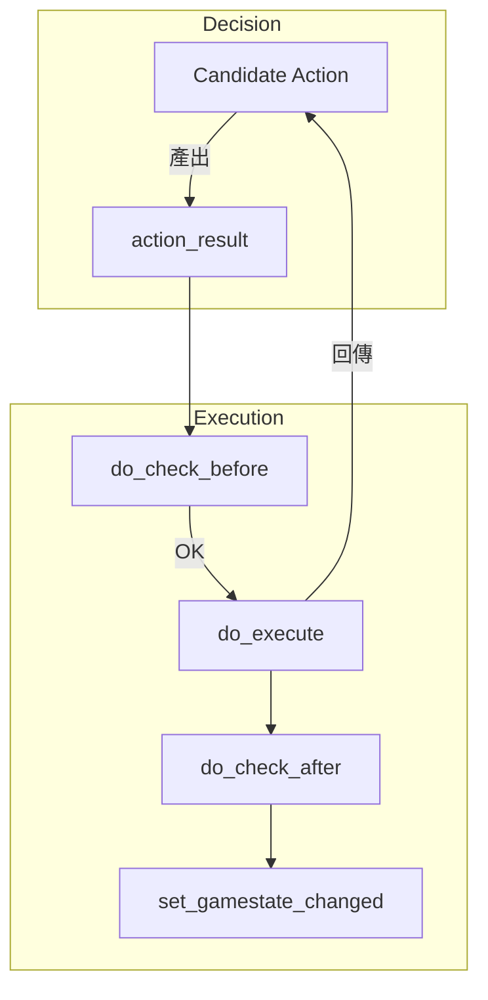

# Wesnoth 技術全典：行動執行與模擬系統全檔案解析 (完整工程版)

本卷窮舉並解構 `src/ai/actions.cpp` 與 `simulated_actions.cpp`。這是 AI 從「想做什麼」到「實際執行」的轉換層。

---

## 1. 行動執行架構圖

---

## 2. 檔案解析：`actions.cpp`
定義與實作 AI 所有的遊戲互動介面。

### 2.1 基礎類別 `action_result`
- **`check_before()` / `check_after()`**：
  - **安全性驗證**：確保 AI 動作符合遊戲規則（如：錢夠不夠、座標是否被占）。這是防止 AI 腳本崩潰的重要屏障。
- **`execute()`**：
  - **原子操作**：執行實際的地圖或單位狀態變更。

### 2.2 具體行動子類別 (Action Types)
- **`attack_result::do_execute()`**：
  - **戰鬥調用**：觸發核心戰鬥引擎，處理機率傷害。
- **`move_result::test_route(unit)`**：
  - **模擬搜尋**：在執行移動前，再次確認路徑是否依然合法（防止路徑中途出現新單位阻斷）。
- **`recruit_result::do_execute()`**：
  - **實體化**：從 `unit_type` 創建單位並扣除金幣。

---

## 3. 檔案解析：`simulated_actions.cpp`
提供「不消耗實際資源」的預演環境。

- **`simulated_recall(...)` / `simulated_recruit(...)`**：
  - **虛擬沙盤**：AI 內部使用的模擬函數。它會暫時修改一份遊戲狀態副本，用來評估「如果我招募了這個單位，三步之後會發生什麼」。
  - **撤銷邏輯**：確保預演後的狀態能被完美恢復，不影響實際遊戲運行。

---

## 4. 檔案解析：`game_info.cpp` / `game_info.hpp`
AI 的資訊獲取層。

- **`game_info::get_unit_map()` / `get_map()`**：
  - **資料快照**：為 AI 提供當前回合開始時的靜態資料圖景，減少因地圖動態變化導致的計算不一致。
