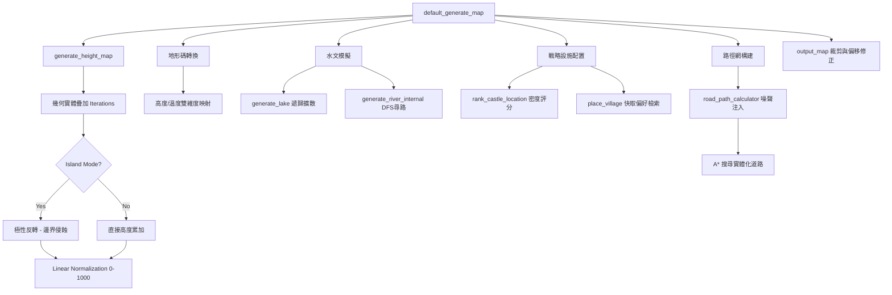
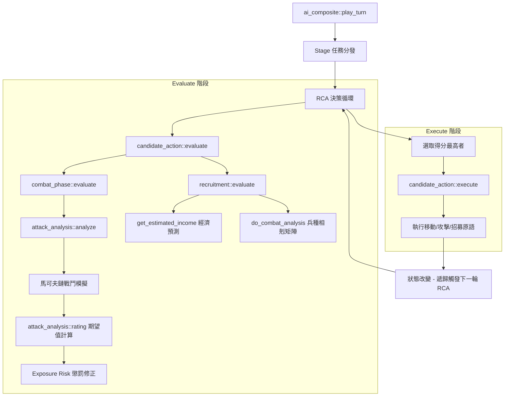
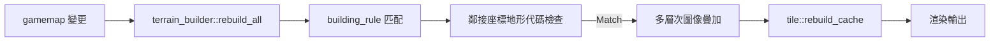

# Wesnoth 技術全典：動態交互與函數呼叫流程圖 (第七卷)

本卷透過 Mermaid 流程圖展示 Wesnoth 核心系統的動態呼叫鏈結 (Call Graphs)，旨在協助工程師理解函數間的執行序向與資料流向。

---

## 1. 程序化地圖生成管線 (Map Generation Pipeline)

此流程圖解構了 `default_map_generator_job` 啟動後的執行路徑，展示了地形從標量場合成到實體化為地圖字串的過程。

---

## 2. AI RCA 決策與戰鬥模擬管線 (AI Decision Pipeline)

此流程圖展示了 AI 如何透過遞歸任務競爭框架，從底層機率模擬推導至高層戰略執行。

---

## 3. 地形渲染拼接流程 (Terrain Rendering Transition)

此圖展示了 `terrain_builder` 如何根據鄰接規則決定圖層。

---
*第七卷解析完畢。此卷提供的流程圖為前六卷的靜態函數解析提供了動態的時間軸與交互視圖。*
*最後更新: 2026-05-17*
