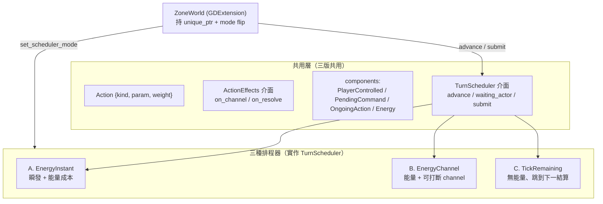

# Action 型別與可切換回合排程器設計（2026-06-07）

> 狀態：設計定案，尚未實作。承接 §7 回合迴圈與 `turn-loop-example.cpp`（order 表模型）。
> 本設計把「下一塊硬骨頭：Action 型別」與「時間/速度模型」一起定下來，並決定**同時實作三種排程器**供切換比較。

## 0. 動機與背景

- 現況（`src/gbind/zone_world_gd.cpp`）是同步單英雄 roguelike：`move()`/`wait_turn()` 讓英雄動一步，`advance_turn()` 跑一次 `npc_ai_system`。無 duration、無 order 表、無多角色。
- §7 收斂出「玩家＝指令來源不同的 actor」的對稱模型；`turn-loop-example.cpp` 進一步定案多角色 order 表（無單一 hero，阻塞＝玩家 actor idle 且無指令）。
- 本設計引入 **ToME4「行動值」(energy) 速度模型** 作為時間軸基礎，並把 Action 表示法、效果時點一併定案。
- ToME4 參考（analysis 索引層、非權威）：`analysis/t-engine/architecture/lua_engine_detail.md:208-245`（GameEnergyBased/GameTurnBased tick）、`:282-304`（timed effect / DoT）。

## 1. 已定案決策

| # | 決策 | 選擇 |
|---|---|---|
| 1 | Action 表示法 | **enum + param**，效果抽成可替換 `ActionEffects` 介面（之後可資料化） |
| 2 | 時間單位 | **整數 tick 細基底**：`TICKS_PER_TURN`，能量制（`ENERGY_TO_ACT`/`ENERGY_PER_TICK`） |
| 3 | 效果時點 | **channel（逐回合）+ resolve（結算）兩條都要** |
| 4 | 速度/排程 | **ToME4 行動值 energy**（速度＝能量累積率） |
| 5 | 範圍 | **三種排程器都做**（A 能量瞬發 / B 能量+channel / C 純 tick remaining） |
| 6 | 裝載 | **可切換**：同一執行檔內 `unique_ptr<TurnScheduler>`，flip mode 比較 |

## 2. 架構總覽

三個排程器共用一套詞彙與介面，**差異只在 `advance()` 內的排程邏輯**。



## 3. 共用詞彙

### 3.1 Action（值型別＝「指令」）

```cpp
enum class ActionKind : uint8_t { Idle, Move, Attack, Cast, Wait };

struct Action {
    ActionKind kind = ActionKind::Idle;
    int param  = 0;   // 方向打包 / 目標 entity / 法術 id
    int weight  = 1;  // 「多重/多長」旋鈕，各排程器各自解讀（見 §5）
    template<class Archive> void serialize(Archive& ar) { ar(kind, param, weight); }
};
```

`weight` 的三版解讀：
- A：能量成本倍率 → `useEnergy(ENERGY_TO_ACT × weight)`，決定之後多久不能動。
- B：channel 回合數（`weight>1` 才進 channel；`≤1` 即刻結算）。
- C：`remaining_ticks = weight × TICKS_PER_TURN`。

### 3.2 ActionEffects（可替換行為介面＝資料化預留）

```cpp
struct ActionEffects {
    // 逐回合效果（B/C 用；A no-op）。turn = 已進行的回合序（0-based）
    virtual void on_channel(World&, entt::entity, const Action&, int turn) {}
    // 結算效果（三版都呼叫）：攻擊命中、火球爆炸、移動落地 + 撞擊/拾取/樓梯/死亡判定
    virtual void on_resolve(World&, entt::entity, const Action&) = 0;
    virtual ~ActionEffects() = default;
};
```

- `World` 持一張註冊表 `ActionKind → ActionEffects*`。**現階段 C++ 寫死註冊**（如 `MoveEffects`、`AttackEffects`、`CastFireballEffects`）；介面穩定後可換成讀資料表，行為邏輯留可組合原語。
- 現有 `move()` 的同步邏輯（移動＋撞擊攻擊＋拾取＋樓梯＋死亡判定，`zone_world_gd.cpp`）**搬進** `MoveEffects::on_resolve` / `AttackEffects::on_resolve`，不丟棄。

### 3.3 共用 components 與訊號

| 元件 | 用途 | 用於 |
|---|---|---|
| `PlayerControlledComponent`（tag） | 標記玩家操控的 actor（**多角色**，取代單一 hero 假設） | 三版 |
| `PendingCommandComponent { Action action; bool present; }` | 玩家/打斷指令收件匣；排程器讀後消費（`present=false`） | 三版 |
| `OngoingActionComponent { Action action; int progress; }` | 進行中 channel 的動作 + 已進行回合數 | B；C 改帶 `remaining_ticks` |
| `EnergyComponent { int value; int speed_mod; }` | 行動值與個體速度修正 | A、B |

- `waiting_actor`（排程器內部狀態，可查詢）：目前卡在哪個玩家 actor（`entt::null` = 沒卡、可續推）。給前端聚焦 UI。
- `HeroComponent` 保留作「相機/主視角跟隨的那一個」，不再等同「唯一可操控者」。

### 3.4 TurnScheduler 介面

```cpp
class TurnScheduler {
public:
    virtual void advance(World&) = 0;                       // 推進一步或卡玩家
    virtual entt::entity waiting_actor() const = 0;
    virtual void submit(entt::entity, const Action&) = 0;   // 下指令 / 打斷
    virtual ~TurnScheduler() = default;
};
```

`World` 打包：`entt::registry&`、`MapData&`、`ActionEffects` 註冊表、設定常數（`TICKS_PER_TURN` 等）、決定性 RNG。

**統一語意**：`advance()` = 推進到「下一個 actor 出手一次」或「卡在某玩家 actor」為止。計時器每次 fire 呼叫一次 → 畫面看到一步（推進與渲染解耦）。

玩家 vs NPC 的差別三版一致：**player actor idle 且無 pending → 設 `waiting_actor`、阻塞**；NPC 由 `npc_ai_decide()` 供下一個 action（現由 `npc_ai_system` 的 50% 漫遊包裝）。

## 4. 常數（World 設定，可調）

```cpp
ENERGY_TO_ACT   = 1000;  // 能量達此值才能出手（ToME4 預設）
ENERGY_PER_TICK = 100;   // 每 tick 基礎能量增量（速度 1 時，10 ticks = 1 回合）
TICKS_PER_TURN  = 10;    // 1 標準回合 = 10 ticks
```

## 5. 三種排程器的 `advance()`

### A. EnergyInstant（純 ToME4：瞬發 + 能量成本）

```
internal-tick 累積能量直到某 actor energy ≥ ENERGY_TO_ACT → 該 actor 出手：
  若 player 且 無 pending → waiting_actor = e; return        // 阻塞
  a = (player ? consume pending : npc_ai_decide(e))
  on_resolve(W, e, a)                                        // 立即結算
  e.energy -= ENERGY_TO_ACT × a.weight                       // useEnergy
return（推進到此次出手即止）
```
- 無 channel；`on_channel` 不觸發。持續傷害（DoT）之後走獨立 timed-effect 系統，本版不做（記為延伸）。
- 速度＝`speed_mod` 影響每 tick 能量增量，快角更常出手。

### B. EnergyChannel（能量排程 + 可打斷 channel）★ 最完整

```
能量累積決定何時輪到某 actor（同 A）。輪到時：
  若該 actor 無 OngoingAction（idle、需新動作）：
     若 player 且 無 pending → waiting_actor = e; return     // 阻塞
     a = (player ? consume pending : npc_ai_decide(e))
     若 a.weight ≤ 1: on_resolve(W,e,a); e.energy -= ENERGY_TO_ACT   // 單回合動作
     否則: 啟動 channel → OngoingAction{a, progress=0}
  若該 actor 正在 channel：
     on_channel(W, e, og.action, og.progress)
     og.progress++; e.energy -= ENERGY_TO_ACT                // 扣一回合能量
     若 og.progress == og.action.weight:                     // channel 完成
        on_resolve(W, e, og.action); 清除 OngoingAction
        （下一次輪到時再依 player/NPC 取下一個動作）
return
```
- **打斷**：`submit` 覆寫 OngoingAction，channel 重設（progress 歸零）。
- 快角能量快 → 同樣 3 回合 channel 在較少世界 tick 內跑完。

### C. TickRemaining（無能量、跳到下一結算）

```
每個忙碌 actor 的 OngoingAction 帶 remaining_ticks（啟動時 = weight × TICKS_PER_TURN）。
advance(W):
  若有 player actor idle 且 無 pending → waiting_actor = e; return   // 阻塞
  dt = min(各忙碌 actor 的 remaining_ticks)
  世界時鐘 += dt；各忙碌 actor remaining_ticks -= dt
     （跨回合邊界時觸發 on_channel）
  對 remaining_ticks == 0 者：on_resolve → 取下一個動作
     （player → idle/阻塞；NPC → npc_ai_decide，remaining = weight × TICKS_PER_TURN）
return
```
- 速度靠不同 weight；無 ToME 風「加速率 buff」表達，但最簡。

## 6. 接進 ZoneWorld（GDExtension）

- `ZoneWorld` 持 `std::unique_ptr<TurnScheduler> scheduler_` + `SchedulerMode mode_`。
- 新方法 `set_scheduler_mode(int)`：flip A/B/C（重建排程器；切換策略見 §8 開放項）。
- **輸入**：Godot input → `scheduler_->submit(actor, build_action(event))`（方向鍵 → `Action{Move, dir}`，攻擊 → `Action{Attack, target}` 等）。
- **推進**：計時器 `_on_advance_timer`（獨立於渲染，沿用 2026-06-03 設計 §7 解耦）→ `scheduler_->advance(world_)` → 讀 `waiting_actor()` 聚焦 UI → `emit_signal("world_changed")` 觸發渲染。
- **搬家而非重寫**：`move()`/`wait_turn()`/`advance_turn()` 的同步邏輯重新編組進 `ActionEffects`；`npc_ai_system` 包成 `npc_ai_decide()`。

## 7. 建置順序（漸進）

1. 共用 core：`Action`、`ActionEffects` 介面 + 註冊表、共用 components、`World` 打包、`TurnScheduler` 介面。
2. **A. EnergyInstant** + ctest（最簡，先讓能量制跑通）。
3. **B. EnergyChannel** + ctest（channel/打斷）。
4. **C. TickRemaining** + ctest。
5. `MoveEffects`/`AttackEffects`/`CastFireballEffects`：把現有 `move()` 邏輯搬進 `on_resolve`。
6. ZoneWorld 接線 + `set_scheduler_mode` flip + 計時器推進。
7. Godot 端：輸入 → submit、計時器 → advance、`waiting_actor` 聚焦。

## 8. 測試（純 core ctest，不接 Godot）

決定性種子情境（排程器直接吃 `World`/registry，可離線測）：

| 情境 | 驗證 | 適用 |
|---|---|---|
| 速度差 | 快角(speed_mod×2) 出手次數 ≈ 慢角 2 倍 | A、B |
| channel 完成 | `weight=3` 動作第 3 回合才 `on_resolve`，`on_channel` 觸發 turn 0→2 | B、C |
| 打斷 | channel 中 `submit` 新動作 → 舊 channel 取消、不 resolve | B、C |
| 玩家阻塞 | `advance` 停在 idle 玩家 actor、`submit` 後續推 | A、B、C |
| 多角色 | 兩個 `PlayerControlled` actor 依序各自阻塞 | A、B、C |

## 9. 開放項（實作中再定，不阻塞本 spec）

- `set_scheduler_mode` 切換時的狀態處理：重置世界 vs 盡量沿用（能量/channel 狀態在三版間語意不同，傾向切換即重置該關卡）。
- `Action.param` 的方向/目標打包格式（先用簡單整數編碼）。
- NPC 累積未演繹時間上限（防離線爆衝）——暫緩。
- channel 期間玩家想對「別的」自己角色下令的輸入路由（多角色 + channel 疊加情境）——先以「掃到該 actor 才讀」處理。
- DoT/timed-effect 獨立系統（A 版的持續傷害）——延伸，不在本 spec。

## 10. 不變核心（跨三版皆成立）

- 玩家＝「指令來源不同的 actor」，無玩家特判。
- 阻塞＝玩家 actor idle 且無指令的自然狀態，C++ 不 spin。
- 打斷＝覆寫 pending/OngoingAction，無指令佇列。
- 推進與渲染解耦：計時器驅動 `advance`，渲染走自己的時鐘。
