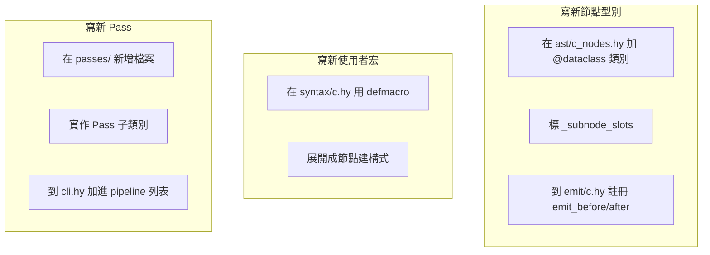

# 01 — 整體架構

## 1. 三層結構

hymera 與 c-mera 共享同樣的設計骨幹：**讀進 sexp → 改寫為 AST → 印出文字**。差別只是宿主從 Common Lisp 換成 Hy/Python。

對應到目錄：

| 階段 | 程式碼位置 | 對應 c-mera |
|---|---|---|
| **泛型函式機制** | `src/hymera/generic.hy` | CLOS（內建） |
| **使用者層宏（Syntax）+ quoty** | `src/hymera/syntax/{c,cpp,quoty}.hy` | `src/c/syntax.lisp`、`src/c-mera/utils.lisp` |
| **AST 節點 + defnode 家族** | `src/hymera/ast/{base,c_nodes,cpp_nodes}.hy` | `src/c-mera/nodes.lisp`、`src/c/nodes.lisp` |
| **Pass 流水線** | `src/hymera/passes/{flatten,else_if,if_blocker,decl_blocker,renamer}.hy` | `src/c/cm-c.lisp:18` 的 `c-processor` |
| **Emit + proxy** | `src/hymera/emit/{core,c,cpp}.hy` | `src/c/pretty.lisp`、`src/c-mera/pretty.lisp` |
| **CLI** | `src/hymera/cli.hy` | `src/c-mera/c-mera.lisp` 的 `define-processor` |

## 2. 「讀進來」這一段：在 quoty 階段做字串拆解

c-mera 透過 char-level reader macros 攔截空白／左括號做字串解析（`projects/c-mera/src/c/reader.lisp`）。Hy reader 不能任意覆寫字元級行為，但 hymera **在 `quoty` 階段對 symbol 字串做拆解**，達成 90% 相同的體驗：

| 想表達的 C | hymera v1 寫法 | 處理機制 |
|---|---|---|
| `p->x` | `p->x`（直接寫，會被 quoty cook） | symbol 字串內含 `->`，quoty 拆 |
| `obj.x` | `obj.x` | symbol 含 `.`，quoty 拆 |
| `arr[i]` | **`(aref arr i)`** | `[` 是 Hy 語法分隔符，無法做 reader sugar（**唯一不對齊**） |
| `i++` | `i++` | symbol 結尾 `++`，quoty 拆 |
| `++i` | `++i` | symbol 開頭 `++`，quoty 拆 |
| `0.5f` | `0.5f` | symbol 結尾 `f`，quoty 識別為帶後綴的浮點 |
| `std::cout` | `std::cout` | symbol 含 `::`，quoty 拆 |

詳細規則見 [`05_syntax_macros.md`](05_syntax_macros.md) §3 與 [`decisions/0004-reader-sugar-and-arr-asymmetry.md`](decisions/0004-reader-sugar-and-arr-asymmetry.md)。

## 3. 「改寫」這一段：為什麼需要多 pass

`Pass` 之所以拆成獨立步驟，是因為某些印出決策依賴**整體 AST 的形狀**，不是看單一節點就能決定的：

| Pass | 為什麼要在這裡 |
|---|---|
| `flatten-nodelists` | 宏巢狀展開後，nodelist 容易產生「list 裡有 list」，先攤平讓後續邏輯不必處理多層 |
| `else-if-marker` | `if` 的 else 是另一個 `if` 時要印成 `else if` 而非新縮排塊；得回頭標記原 AST |
| `block-decider` | 單句 if/while/for 不加大括號；得看子節點才能決定 |
| `renamer` | Lisp 風格 `kebab-case` 識別字要轉 C 的 `snake_case`，且要在「同個 AST」內保持一致映射；單看一個葉子節點做不到 |

執行順序見 `docs/03_traverser_and_passes.md` §3。

## 4. 「印出」這一段：分派模型

走 `defgeneric` / `defmethod` 機制（決策見 [`decisions/0001-clos-style-method-combination.md`](decisions/0001-clos-style-method-combination.md)），與 c-mera 的 CLOS 形狀一致。每個節點型別可註冊三種限定詞的列印方法（`defprettymethod` 是封裝）：

| 限定詞 | 行為 |
|---|---|
| `:before` | 印節點開頭、push 上下文、調縮排 |
| `:after` | 印節點結尾、pop 上下文 |
| `:self` | 對控制結構等「**子節點之間要插字**」的場景完全接管 |

橫切列印關注（如「型別後空白」）用 proxy 節點（[`decisions/0003-implement-proxy-nodes.md`](decisions/0003-implement-proxy-nodes.md)）。

## 5. 三條主要流向

從使用者觀點看，三件事各自有清楚的入口：

三條完全互不耦合。新加一個 C++ 特性（例如 `constexpr` 修飾）通常是「節點 + 宏 + emit」三件事，不需要動到 Pass。

## 6. 後續閱讀順序

1. [`02_ast_shape.md`](02_ast_shape.md) — 節點怎麼定義（`defnode` 家族五件套）
2. [`03_traverser_and_passes.md`](03_traverser_and_passes.md) — `defgeneric` / `defmethod`、Pass 流水線
3. [`04_emit_interface.md`](04_emit_interface.md) — Emitter、`defprettymethod` `:before`/`:after`/`:self`、proxy 機制
4. [`05_syntax_macros.md`](05_syntax_macros.md) — `defsyntax` / `c-syntax`、`quoty`、核心 shadow
5. [`06_cpp_extensions.md`](06_cpp_extensions.md) — C++ 子集的擴充點
6. [`07_examples.md`](07_examples.md) — v1 預計達成的四個範例
7. [`decisions/`](decisions/) — 四份關鍵設計決策（ADR 0001-0004）
