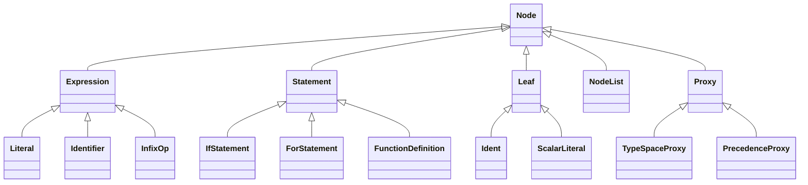

# 02 — AST 節點形狀

> 對照：`analysis/c-mera/architecture/level3_ast_and_traverser.md`、`projects/c-mera/src/c-mera/nodes.lisp:22-68`、`projects/c-mera/src/c/nodes.lisp:8-73`
>
> 對齊度：完全（API 形狀與 c-mera 1:1）。底層用 Hy `defclass`，不是 Python `@dataclass`。

## 1. 類別體系



- **`Node`**：所有節點的基底。提供 `_value_slots` / `_subnode_slots` 兩個類層級屬性、`__init__` 接 kwargs、`__repr__` 顯示節點型別與槽位。
- **`Expression`** / **`Statement`** / **`Leaf`**：與 c-mera 對等的三條主軸。
- **`NodeList`**：包子節點序列的唯一節點（對應 `projects/c-mera/src/c-mera/nodes.lisp:68`）。
- **`Proxy`**：traverser 階段臨時插入的代理節點（對應 `projects/c-mera/src/c-mera/nodes.lisp:65`）。詳見 [`04_emit_interface.md`](04_emit_interface.md) §6。

## 2. 五個定義宏（API 與 c-mera 1:1）

| 宏 | 父類 | 用途 |
|---|---|---|
| `defnode` | `Node` | 一般結構節點 |
| `defstatement` | `Statement` | C 語句 |
| `defexpression` | `Expression` | C 表達式 |
| `defleaf` | `Leaf` | 葉節點（識別字、字面值） |
| `defproxy` | `Proxy` | traverser 臨時節點 |

### 2.1 簽章與 c-mera 對齊

```
(defNODE name (values...) (subnodes...))
```

對應 c-mera：
```lisp
(defstatement if-statement () (test if-body else-body))
```

hymera：
```hylang
(defstatement if-statement () (test if-body else-body))
```

完全相同的形狀。中間 `()` 為純值槽（不被 traverser 遞迴），後者為子節點槽（遞迴）。

### 2.2 宏展開做什麼

每個 `defNODE` 展開為三件事（對應 `projects/c-mera/src/c-mera/nodes.lisp:22-50`）：

1. **生成 Python class**（透過 Hy `defclass`），繼承自對應父類。
2. **記錄類層級 `_value_slots` 與 `_subnode_slots`** 兩個 tuple，供 traverser 在預設方法裡使用。
3. **生成 `make-NAME` 建構宏**，方便語法層引用（對應 c-mera 的 `MAKE-<NAME>`）。

骨架（`src/hymera/ast/base.hy`）：

```hylang
(defmacro defnode [name values subnodes]
  "(defnode point () (x y))
   等價於：
   (defclass Point [Node]
     (setv _value_slots #())
     (setv _subnode_slots #(\"x\" \"y\"))
     ...)"
  `(do
     (defclass ~name [Node]
       (setv _value_slots   ~(tuple (lfor v values (str v))))
       (setv _subnode_slots ~(tuple (lfor s subnodes (str s))))
       (defn __init__ [self #** kwargs]
         (for [slot (+ self._value_slots self._subnode_slots)]
           (setattr self slot (.get kwargs slot None)))
         (.update self.__dict__ kwargs))
       (defn __repr__ [self]
         ;; ... 列出所有槽位
         ...))
     (defmacro ~(make-symbol name) [#* args]
       `(~~name ~@args))))
```

`defstatement`、`defexpression`、`defleaf`、`defproxy` 與 `defnode` 同形，只是繼承的父類不同。`make-symbol` 是 eval-and-compile 階段的輔助函式，把 `point` 轉成 `make-point`。

## 3. 範例：C 端的核心節點

對映 `projects/c-mera/src/c/nodes.lisp:8-73`：

```hylang
;; src/hymera/ast/c_nodes.hy 草案
(import hymera.ast.base [defnode defstatement defexpression defleaf])

;; -- 表達式 ---------------------------------
(defexpression infix-expression  (op) (operands))
(defexpression prefix-expression (op) (operand))
(defexpression postfix-expression (op) (operand))
(defexpression function-call     ()   (func args))
(defexpression assignment-expression (op) (variable value))
(defexpression member-access     (kind) (object name))      ; kind: '. or '->
(defexpression subscript-expression () (array index))
(defexpression cast-expression   ()   (type expr))
(defexpression ternary-expression () (test then else))

;; -- 葉 -------------------------------------
(defleaf ident          (name)  ())
(defleaf scalar-literal (value suffix) ())
(defleaf type-ref       (name)  ())

;; -- 語句 -----------------------------------
(defstatement if-statement     (else-if?) (test if-body else-body))
(defstatement for-statement    (need-block?) (init test step body))
(defstatement while-statement  (need-block?) (test body))
(defstatement do-while-statement () (body test))
(defstatement switch-statement () (test body))
(defstatement case-clause       () (value body))
(defstatement break-statement   () ())
(defstatement continue-statement () ())
(defstatement return-statement  () (value))
(defstatement expression-statement () (expr))
(defstatement compound-statement () (statements))

;; -- 宣告 -----------------------------------
(defstatement declaration-item    () (specifier type id init))
(defstatement declaration-list    (in-block?) (items))
(defstatement function-definition () (item parameter body))
(defstatement struct-definition   (kind) (name body))      ; kind: 'struct or 'union
(defstatement typedef-definition  () (type alias))
(defstatement enum-definition     () (name members))

;; -- 前處理 ---------------------------------
(defstatement preproc-include () (path is-system?))
(defstatement preproc-define  () (name value))
(defstatement preproc-ifdef   () (name body else-body))
(defstatement translation-unit () (items))
```

每行對應一個 c-mera 節點，命名與 slot 順序貼合 `projects/c-mera/src/c/nodes.lisp`。

## 4. NodeList：序列容器

對映 `projects/c-mera/src/c-mera/nodes.lisp:68`：

```hylang
(defclass NodeList [Node]
  "包子節點序列。flatten-nodelists pass 保證不嵌套。"
  (setv _value_slots #())
  (setv _subnode_slots #("nodes"))

  (defn __init__ [self [nodes None]]
    (setv self.nodes (list (or nodes []))))

  (defn __iter__    [self] (iter self.nodes))
  (defn __len__     [self] (len self.nodes))
  (defn __getitem__ [self k] (get self.nodes k)))
```

## 5. Proxy：traverser 臨時節點

```hylang
;; src/hymera/ast/base.hy
(defclass Proxy [Node]
  "Proxy 節點基底。emit 階段臨時包住某槽位，列印完拆掉。"
  (setv _value_slots #())
  (setv _subnode_slots #("wrapped"))

  (defn __init__ [self wrapped]
    (setv self.wrapped wrapped)))

(defmacro defproxy [name values subnodes]
  "與 defnode 同形，繼承 Proxy。"
  `(do
     (defclass ~name [Proxy]
       (setv _value_slots   ~(tuple (lfor v values (str v))))
       (setv _subnode_slots (+ #("wrapped") ~(tuple (lfor s subnodes (str s)))))
       ...)
     (defmacro ~(make-symbol name) [#* args]
       `(~~name ~@args))))
```

詳細用法（含 `with-proxynodes` / `make-proxy` / `del-proxy` / `defproxyprint`）見 [`04_emit_interface.md`](04_emit_interface.md) §6 與 [`decisions/0003-implement-proxy-nodes.md`](decisions/0003-implement-proxy-nodes.md)。

## 6. C++ 擴充節點

詳見 [`06_cpp_extensions.md`](06_cpp_extensions.md)。要點：

```hylang
;; src/hymera/ast/cpp_nodes.hy
(defstatement class-definition (kind) (name bases body))   ; kind: 'class or 'struct
(defstatement base-clause       (access) (name))
(defstatement access-specifier  (kind) ())
(defstatement namespace-definition () (name body))
(defstatement template-definition () (parameters target))
(defstatement template-type-param  (kind) (name default))   ; kind: 'typename or 'class
(defstatement template-value-param () (type name default))
(defstatement using-declaration   (kind) (qualified-name alias-target))
(defexpression new-expression     () (type ctor-args array-size))
(defexpression delete-expression  (is-array?) (target))
(defstatement method-definition   (owner) (item parameter body))
```

## 7. 怎麼新增一個節點型別

四步——與 c-mera 完全相同的工作流：

1. **挑類別**：表達式 → `defexpression`、語句 → `defstatement`、葉 → `defleaf`。
2. **寫定義**：`(defstatement my-stmt (純值槽...) (子節點槽...))`。
3. **在 `emit/c.hy` 或 `emit/cpp.hy` 註冊 `defprettymethod`**：通常需要 `:before`、`:after`，特殊情況下用 `:self` 完整接管。
4. **若使用者要直接寫該節點，到 `syntax/c.hy` 加宏**：通常用 `defsyntax` / `c-syntax` 一行搞定。

不需要動到 traverser、Pass、generic function 機制。

## 8. 位置資訊（v1 可省）

c-mera 把符號位置記在節點上以利錯誤回報。v1 先不做。需要時加 `_loc: tuple[int, int] | None = None` 屬性；可從 Hy reader 的 model 位置（`projects/hy/hy/models.py:40` 起的 `start_line` 等）取得。
