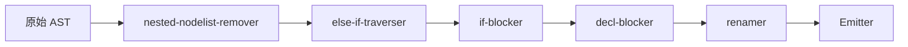

# 03 — 遍歷器與 Pass 流水線

> 對照：`analysis/c-mera/architecture/level3_ast_and_traverser.md` §「Traverser 泛型」、`projects/c-mera/src/c-mera/traverser.lisp:6-22`、`projects/c-mera/src/c/cm-c.lisp:18`
>
> 對齊度：高。底層用自製 `defgeneric` / `defmethod`（決策見 [`decisions/0001-clos-style-method-combination.md`](decisions/0001-clos-style-method-combination.md)）。

## 1. 泛型函式機制：`defgeneric` / `defmethod`

c-mera 的 traverser 是 CLOS 兩參數泛型函式 `(traverser tr node)`。hymera 提供同形 API：

```hylang
;; 定義泛型函式
(defgeneric traverse [traverser node])

;; 預設方法：對所有 _subnode_slots 遞迴
(defmethod traverse ((tr Traverser) (n Node))
  (for [slot n._subnode_slots]
    (setv child (getattr n slot None))
    (cond
      (is child None)         (continue)
      (isinstance child list) (for [c child] (traverse tr c))
      True                    (traverse tr child))))

;; 為 NodeList 加獨立方法（對應 traverser.lisp:22）
(defmethod traverse ((tr Traverser) (n NodeList))
  (for [c n.nodes] (traverse tr c)))

;; 客製 traverser：只要為自己關心的型別新增 :before/:after
(defmethod traverse :before ((tr Renamer) (n Ident))
  (setv n.name (.rename tr n.name)))
```

`defgeneric`/`defmethod` 由 `src/hymera/generic.hy` 提供，實作概念見 [`decisions/0001-...md`](decisions/0001-clos-style-method-combination.md) §「實作骨架」。

## 2. 方法組合語意

| 限定詞 | 執行 | 順序 |
|---|---|---|
| `:before` | **全部** applicable 方法都跑 | 最具體 → 最不具體 |
| 主要（無限定詞） | **只跑最具體一個** | — |
| `:after` | **全部** applicable 方法都跑 | 最不具體 → 最具體 |
| `:self` | **若存在則接管**，跳過 :before/primary/:after | 最具體 |

這直接對映 CLOS 標準方法組合，與 c-mera 的 `defprettymethod` 行為一致（`projects/c-mera/src/c-mera/pretty.lisp:1-30`）。

## 3. Traverser 基底與 Pass

```hylang
;; src/hymera/traverser.hy
(defclass Traverser []
  "所有 traverser 的基底。子類別透過 (defmethod traverse ...) 加邏輯。")

(defclass Pass [Traverser]
  "AST 改寫 pass 的基底。
   設計：『回傳新節點』風格（dataclasses.replace 在 c-mera 是 setf；
   hymera 為了測試方便採不可變）。

   Pass 子類別覆寫 transform 方法，而非 traverse；
   transform 走訪 AST、需要改寫處回傳新節點。"

  (defn run [self root]
    "Pass 的對外入口：跑一遍、回傳改寫後的 root 節點。"
    (.transform self root))

  (defn transform [self node]
    "預設：對 _subnode_slots 遞迴改寫，不變更 _value_slots。"
    ...))

(defn run-pipeline [passes root]
  "依序跑一連串 Pass。"
  (for [p passes]
    (setv root (.run p root)))
  root)
```

`Pass.transform` 內部仍然倚賴 `traverse` 泛型——Pass 想對某型別做特殊處理，就為該型別註冊 `(defmethod transform :around ((p MyPass) (n SomeNode)) ...)` 或 `:before` / `:after`。

> v1 的 `defmethod` 不支援 `:around` 與 `call-next-method`；Pass 子類別覆寫 `transform` 時直接呼叫 `(.transform (super) node)` 走預設行為。

## 4. 流水線順序（與 c-mera 對齊）

對映 c-mera `c-processor`（`projects/c-mera/src/c/cm-c.lisp:18`）。v1 **與 c-mera 一一對應**，**不合併** if-blocker / decl-blocker：



| 順序 | Pass | 任務 |
|---|---|---|
| 1 | `nested-nodelist-remover` | 攤平嵌套 NodeList |
| 2 | `else-if-traverser` | 若 If.else-body 是另一個 If，標記為 else-if 串接 |
| 3 | `if-blocker` | 為 If 的分支決定是否包大括號（單句不包） |
| 4 | `decl-blocker` | 為 declaration-list 決定是否包大括號（取決於巢狀） |
| 5 | `renamer` | kebab-case → snake_case，並維持一致映射 |
| 6 | `Emitter`（不是 Pass，是 pretty-printer traverser） | 輸出文字 |

## 5. Pass 範例：renamer

對映 `projects/c-mera/src/c/traverser.lisp:14-60`：

```hylang
(defclass Renamer [Pass]
  (defn __init__ [self]
    (.__init__ (super))
    (setv self.name-map {}))

  (defn rename [self original]
    (when (in original self.name-map)
      (return (get self.name-map original)))
    (setv candidate (.replace original "-" "_"))
    (while (in candidate (.values self.name-map))
      (setv candidate (+ candidate "_")))
    (setv (get self.name-map original) candidate)
    candidate))

;; 用 defmethod 註冊 :before 行為（renamer 是 Pass，但對 Ident 走訪前就改名）
(defmethod traverse :before ((r Renamer) (n Ident))
  (setv n.name (.rename r n.name)))
```

> Pass 與 Traverser 的關係：`Pass` 是 `Traverser` 的子類，所以 `defmethod traverse` 註冊到 `Pass` 也有效。在 emit 階段，Emitter 也是一個 Traverser（見 [`04_emit_interface.md`](04_emit_interface.md)），用同一套 `traverse` dispatch。

## 6. 加 Pass 的流程

1. 在 `src/hymera/passes/` 新增 `.hy`，定義 `(defclass MyPass [Pass] ...)`。
2. 視需要為 Pass 註冊 `(defmethod traverse :before/:after ...)` 或覆寫 `transform`。
3. 到 `src/hymera/cli.hy` 把 `MyPass` 加進 pipeline 列表的正確位置。
4. 在 `tests/` 加輸入/輸出對照測試。

## 7. 與 c-mera 的微差

| c-mera | hymera v1 |
|---|---|
| `(traverser tr node level)` 三參數 | `(traverse traverser node)` 兩參數（不傳 level；若需縮排深度由 Emitter 自己維護） |
| `setf`-style mutating traverser | 「回傳新節點」風格的 Pass 與「mutating during emit」的 Emitter 並存 |
| `call-next-method` | 直接 `(.transform (super) node)` |
| `:around` | 不支援；v2 視需要追加 |

其餘形狀（defgeneric / defmethod / `:before` / `:after` / `:self`、Pass 流水線順序與名稱）完全對齊。
