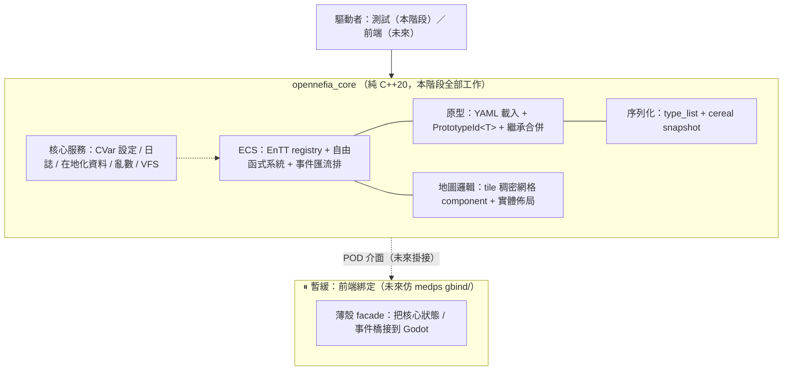

# 01 — 核心架構（godot-free C++ 核心）

> 本文定義 opennefia-cpp **核心階段**的整體架構。基於 `analysis/medps/architecture/02_core_patterns.md` 的六條藍本，把 OpenNefia 的 C# 引擎核心搬到不靠反射、不碰前端的 C++20。

---

## 1. 分層原則：核心是函式庫，不是應用程式

OpenNefia C# 由 `GameController` 擁有 `Main()` 與主循環，是一支**應用程式**。本專案反過來——核心是一支**函式庫**，沒有 `main()`，由外部（測試，未來是前端）驅動。這正是 medps 的形態（`analysis/medps/architecture/01_overview.md:5`）。



**邊界鐵則**：`opennefia_core` 目標的任何編譯單元都不得 include 前端 / 圖形 / godot 標頭。用 CMake 目標分離強制（見 `03_roadmap.md` Phase 0），而非僅靠約定。

---

## 2. 目標目錄結構（規劃）

```
opennefia-cpp/
├── CMakeLists.txt              # 雙目標：opennefia_core(STATIC) + 未來 opennefia_gd
├── src/
│   └── core/                   # ← 本階段全部工作（godot-free）
│       ├── ecs/                # EntityManager 薄封裝 / 事件匯流排 / 系統註冊
│       ├── components/         # POD 組件（MetaData / Spatial / 內容組件...）
│       ├── systems/            # 自由函式系統（void(registry&, Ctx&)）
│       ├── prototypes/         # PrototypeManager / PrototypeId / YAML 載入
│       ├── serialize/          # all_components / save_load / cereal adapter
│       ├── maps/               # 地圖邏輯（MapData：tile 網格 component）
│       ├── services/           # ServiceContext（CVar / Log / Locale / Random）
│       └── util/               # 數學 / ResourcePath / tdarray 類
│   └── (gbind/)                # ⏸ 暫緩：前端綁定，本階段不建
├── tests/
├── docs/
└── data/                       # 範例原型 YAML（測試用）
```

> 命名上保留 OpenNefia 的語意（EntityManager / PrototypeManager），但實作骨子是 medps 那套。

---

## 3. ECS：薄封裝 EnTT，但盡量別擋路

OpenNefia 的 `EntityManager` 帶生命週期狀態機（`ComponentLifeStage` / `EntityLifeStage`）。medps 證明**多半不需要包一層**（`analysis/medps/architecture/02_core_patterns.md` 模式四附註）。本專案折衷：

- **底層直接是 `entt::registry`**。查詢一律用 `registry.view<...>()`，不自製查詢 API。
- 提供一個**薄** `EntityManager`，只負責 OpenNefia 真正需要的加值：
  - `SpawnEntity(PrototypeId)`：依原型組裝 component（原型系統的入口，§5）。
  - 生命週期事件：若要保留 OpenNefia 的「ComponentInit / EntityTerminating」語意，用 **EnTT 原生 signal**（`on_construct<T>` / `on_destroy<T>`）實作，不要手寫狀態機。
- **MetaDataComponent**（原型 id、是否存活）與 **SpatialComponent**（座標、父子關係 ＝ OpenNefia scene graph）是每個實體的基礎組件。

### 事件匯流排（OpenNefia 解耦的關鍵）

OpenNefia 有三種事件：廣播 / 定向（針對某實體）/ 排序。對照 medps：medps 目前系統直接 iterate view、還沒做事件匯流排，所以這塊**OpenNefia 比 medps 更需要、需自行設計**：

- **廣播事件**：用 `entt::dispatcher`（trigger / sink）即可。
- **定向事件**（`RaiseLocalEvent(entity, ev)`）：EnTT 無內建。設計一個 `EventBus`，以 `(事件型別, 目標 component)` 為鍵存訂閱清單；發送時針對單一 entity 派發。優先級用穩定排序的訂閱序。
- **不要靠反射訂閱**：訂閱在系統的 `Initialize()` 明確寫出（如 `Subscribe<DamageEvent>(&Sys::OnDamage)`），對應 medps「明確註冊」哲學。

> 這是本專案**比 medps 多做**的部分；設計細節留 `02_subsystem_mapping.md` 與後續實作。

---

## 4. 系統：自由函式 + 明確註冊（核心取捨）

預設採 medps 形態（`02_core_patterns.md` 模式四）：

```cpp
// 形態 A：純無狀態（醫 medps movement.h）
namespace systems { void turn_order(entt::registry& reg); }
```

但 OpenNefia 系統常需存取其他服務（PrototypeManager、Locale、Random）。為避免落回 C# 的 DI 反射，採**顯式 Context 傳參**：

```cpp
// 形態 B：吃一個明確的服務 context，不做反射注入
struct SystemCtx { PrototypeManager& proto; Random& rng; Locale& loc; EventBus& bus; /* ... */ };
namespace systems { void damage(entt::registry& reg, SystemCtx& ctx); }
```

- 系統清單在啟動時**手動註冊一個 vector**，順序即執行序——非 Assembly 掃描。
- 對「系統間有依賴」的情況，在註冊端用拓樸順序手排，或保留 OpenNefia 的依賴宣告但改成**啟動期明確建圖**（不靠執行期反射）。

> 決策記於 `docs/decisions/`（待補）：為何選顯式 Context 而非 ServiceLocator 全域單例——讓系統依賴在簽名上一目了然、可單元測試。

---

## 5. 原型系統：YAML → 記憶體原型 → SpawnEntity

OpenNefia 的資料驅動核心（`analysis/OpenNefia/architecture/06_prototype_serialization.md`）。在 C++：

- **`PrototypeId<T>`**：強型別封裝一個字串 id（如 `PrototypeId<EntityPrototype>`），編譯期區分「角色原型 id」與「物品原型 id」。對應 OpenNefia 的型別安全參考。
- **`PrototypeManager`**：多型別存放（`unordered_map<string, Prototype>` per type）。載入時解析 `parent` 欄位做**繼承合併**（依賴圖排序後逐層覆蓋）。
- **載入**：用 **yaml-cpp** 讀 YAML（這是本專案相對 medps 多出來的相依——medps 的持久化是 cereal binary，但「人寫的原型定義」需要 YAML）。
- **SpawnEntity**：`EntityManager.SpawnEntity(protoId)` 依原型的 component 清單，在 registry 上 `emplace` 出對應 component。

> 注意區分兩種「序列化」：**原型（人編輯的定義）走 YAML 讀入**；**存檔（執行期世界狀態）走 cereal binary snapshot**（§6）。OpenNefia C# 用同一套 SerializationManager 兼顧兩者（靠反射）；C++ 拆成兩條更清晰。

---

## 6. 序列化 / 存讀檔：直接移植 medps 三件套

完全採 medps 做法（`02_core_patterns.md` 模式三）：

1. `serialize/all_components.h`：`using AllComponents = entt::type_list<...>;` 單一真實來源。
2. `serialize/save_load.h`：fold expression 對 `AllComponents` 跑 `entt::snapshot` / `snapshot_loader`（仿 `medps/.../zone_io.h:14`）。
3. `serialize/entt_cereal_archive.h`：`entt::entity` ↔ 底層整數的 cereal adapter（仿 `medps/.../entt_cereal_archive.h:8`）。

- 每張地圖一個 registry → 整圖 snapshot 存檔（對應 OpenNefia `11_save_load_system.md` 的整地圖序列化需求，且 EnTT snapshot 讓它變便宜）。
- 是否採 medps 的「多 registry / ZoneKey / streaming」要看 OpenNefia 世界規模需求——Elona 的地圖數遠小於 medps 的 900 萬 Area，**初版可單一 registry 或少數 registry**，但序列化路徑照 medps 設計，日後要擴張不需重寫。

---

## 7. 核心服務：縮小 DI 範圍到「真．單例」

OpenNefia 用 IoC 容器 + `[Dependency]` 反射注入所有東西。medps 因系統無狀態而**完全不需要 DI**。本專案折衷：

- **少數全域單例服務**（Log / CVar 設定 / Locale / Random / VFS）放一個 `ServiceContext`，以**強型別存取**（`ctx.log()`），非反射。
- **ECS 系統**透過 §4 的 `SystemCtx` 顯式拿到需要的服務，不進全域容器。
- 結論：DI 複雜度被壓到最低——只有真正全域的服務集中，其餘靠函式簽名傳遞。

---

## 8. 本階段不做什麼（再次明確）

- 不寫渲染 / 圖形抽象（無 RaylibGraphics、無 Godot 節點同步）。
- 不寫 UI（Wisp / Control 都不碰）。
- 不寫輸入裝置 / 音效 / 視窗。
- 不寫 `gbind/` 前端綁定。

核心的對外介面會保持「前端友善」（系統產出 POD 狀態 / 事件），但橋接是未來階段的事。詳見 `02_subsystem_mapping.md` 的範圍表與 `03_roadmap.md`。
</content>
