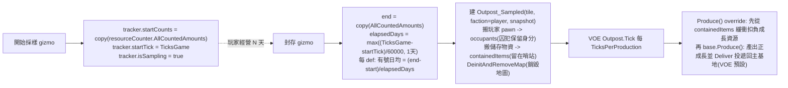

# 殖民地封存哨站 — v1 設計 spec

> 撰寫日期：2026-06-09。權威源＝`projects/rimworld/`（1.6/Odyssey）＋ VOE 反編譯
> `projects/rimworld_mods/vanilla-outposts-expanded/decompiled-framework/Outposts.decompiled.cs`。
> 來源可行性報告：`analysis/rimworld_mods/_mod_ideas/world_map_grand_strategy/06_colony_archival_to_outpost.md`。
> ⚠️ analysis 非權威；本 spec 引用的 API 行號皆已對 `projects/` 源碼核對（見文末權威源清單）。

---

## 1. 目標與玩家體驗

玩家在一座成熟殖民地花一段時間「採樣」其儲存區的淨增長，然後**封存**該殖民地——地圖被銷毀、地圖上所有玩家 pawn（含囚犯，保留身分）轉為抽象占用者，**封存當下儲存區的現有物資放進 outpost 的儲存欄（`containedItems`）當庫存緩衝**，世界地圖留一個 **outpost** 圖標。哨站此後按採樣到的有號淨流運作：**正成長資源持續產出並投遞回主基地（與普通 VOE 產出型哨站一樣）**；**負成長資源每週期從庫存緩衝扣減**，扣到 0 為止。玩家不必再手動經營那張地圖。

核心差異（一句話）：**VOE outpost 產出率寫死在 XML；本 mod 從一個真實運轉過的地圖「測量」出產出率，再餵進 VOE 的抽象產出引擎。**

---

## 2. 範圍

### 2.1 v1 做（已與使用者敲定）
| 決策 | 選定 |
|---|---|
| 封存後可否再訪問 | **A 純抽象，不可再訪問**（不做混合/同圖還原） |
| 抽象產出引擎 | **子類化借 VOE**（`Outpost_Sampled : Outpost`） |
| 採樣法 | **儲存區 delta**（`ResourceCounter` 期初/期末快照相減） |
| 採樣窗口 | **玩家手動開始/結算** |
| 採樣取負成長 | **是**（有號日均；負成長資源在哨站每週期消耗庫存緩衝，見底停 0） |
| 正成長產出去向 | **投遞回主基地**（VOE 預設 Deliver，與普通 VOE 產出型哨站一樣） |
| 封存帶物資 | **帶**（封存當下儲存區物資搬進 outpost `containedItems`，當負成長消耗的庫存緩衝） |
| 囚犯/動物 | **全部變占用者**（沒人隨地圖死）；**囚犯保留囚犯身分**、動物比照 VOE 動物占用者 |
| 最短採樣窗 | **無玩法門檻**；數學防呆下限＝**1 遊戲天** |
| 觸發 UI | 玩家 **Settlement 世界物件**上兩個 gizmo |

### 2.2 v1 不做（YAGNI；其中部分列入 §15 未來範圍）
製作/`RecordsTracker` 採樣、重新採樣/解封、帶物資的選擇 UI、可再訪問/混合路線。

### 2.3 未來範圍（§15；架構不擋，v1 不實作）
占用者數值隨時間變化（技能成長/衰減）、電力產出、迫擊炮等跨地圖武器支援。

---

## 3. 相依與環境
- RimWorld **1.6**，C#（net48）＋少量 XML Def。
- **硬相依**：VEF ＋ VOE ＋ Harmony；`About.xml` 列兩個 `modDependencies` ＋ `loadAfter` 兩者。
- **關鍵釐清（已查本機 workshop）**：`Outpost` 基類在 `Outposts.dll`，**隨 VEF 出貨**（`2023507013/1.6/Assemblies/Outposts.dll`，packageId `OskarPotocki.VanillaFactionsExpanded.Core`，與 KCSG/MVCF/PipeSystem 同捆）。VOE 內容 mod（`2688941031`，`vanillaexpanded.outposts`）只出 `VOE.dll`。
  - **編譯**參考 VEF 裡的 `Outposts.dll`。
  - **執行期**：VEF 對這些模組 DLL 多採「相依 mod 在場才載入」→ 仍需 VOE 啟用，VEF 才會載 `Outposts.dll`、`Outpost` 型別才解析得到。故兩者都硬相依。**待驗證**：僅 VEF（無 VOE）時 `Outpost` 型別是否解析。
- 本機路徑（已驗存在）：
  - 遊戲 Managed：`$(HOME)/.local/share/Steam/steamapps/common/RimWorld/RimWorldWin64_Data/Managed`
  - Outposts.dll：`$(HOME)/.local/share/Steam/steamapps/workshop/content/294100/2023507013/1.6/Assemblies/Outposts.dll`
  - 0Harmony.dll：`$(HOME)/.local/share/Steam/steamapps/workshop/content/294100/2009463077/Current/Assemblies/0Harmony.dll`
- defName 前綴 `pas.archival.*`，組件 namespace `ColonyArchivalOutpost`。

---

## 4. 架構與元件

每個元件一個清楚職責、可獨立理解與測試。

| 元件 | 類型 | 職責 | 依賴 |
|---|---|---|---|
| `Outpost_Sampled` | C# `: Outpost`（VOE 子類） | 持 `ProductivitySnapshot`；override `ResultOptions`＝**正成長**資源（VOE `Produce/Deliver` 照預設投遞回主基地）；override `Produce()`＝先扣**負成長**資源（從 `containedItems` 緩衝減），再 `base.Produce()` 產出並投遞正成長。`Deliver/SatisfyNeeds/Tick` 繼承 | VOE `Outpost`（:731）、`ResultOption`（:2050） |
| `ProductivitySnapshot` | C# `IExposable` | 一張 `Dictionary<ThingDef,float>`（資源→**有號**日均量，正＝產出、負＝消耗）。封存當下算好、`Scribe` 存檔 | 無 |
| `ColonyArchivalTracker` | C# `: MapComponent` | 掛殖民地圖上：`isSampling`、`startTick:int`、`startCounts:Dictionary<ThingDef,int>`（copy 自 `resourceCounter.AllCountedAmounts`）。`ExposeData` 隨存檔走 | `ResourceCounter`（:17） |
| `ArchivalGizmos`（Harmony postfix `Settlement.GetGizmos`） | C# | 玩家家園 Settlement 上加「開始採樣」「封存成哨站」兩 gizmo，狀態依 tracker | Harmony、`ColonyArchivalTracker` |
| `ArchivalService` | C# static | 封存的核心轉換：算率→建 outpost→搬 pawn/物資→銷毀地圖→邊界擋。被「封存」gizmo 呼叫 | VOE `Outpost`、`Game.DeinitAndRemoveMap`（:723） |
| `WorldObjectDef pas.archival.Outpost` ＋ `OutpostExtension` | XML | 哨站外觀/label/biome/cost；`worldObjectClass = Outpost_Sampled`；`ResultOptions` 留空（由子類動態餵）；投遞用 **VOE 預設**（產出送主基地，同普通 VOE 哨站） | VOE `OutpostExtension`（:2014） |
| Keyed（en＋zh-Hant） | XML | gizmo 標籤、信件、tooltip | 無 |

> VOE 子類化是官方擴充模式：反編譯內已有 `Outpost_ChooseResult : Outpost`（:2489）override `ResultOptions`（:826 `public virtual List<ResultOption> ResultOptions => Ext.ResultOptions`）。

---

## 5. 資料流（三段）



- **TicksPerDay = 60000**（`GenDate.TicksPerDay`）。
- `ResourceCounter` 每 204 tick 才更新一次（`ResourceCounter.cs:122`），只計 `def.CountAsResource==true` 且在儲存格內、未腐壞/霧化的物（`:128-168`）。
- 哨站運作＝**正成長產出投遞回主基地**（同普通 VOE 哨站）＋**負成長從封存帶來的 `containedItems` 緩衝扣減**（見底停 0）。

---

## 6. 採樣語意（要點，避免誤解）

1. **有號淨流語意**：每個 def `有號日均 = (end − start)/elapsedDays`，**正負都取**。正＝該資源持續產出並投遞回主基地（同普通 VOE 哨站）；負＝該資源持續被消耗，從哨站 `containedItems` 緩衝扣。封存帶走的物資是負成長資源的初始緩衝。
2. **負成長消耗緩衝、見底停 0**：哨站每產出週期對負成長資源從 `containedItems` 緩衝扣 `|rate|×週期天數`；扣到 0 即停在 0（不產生負庫存），v1 **靜默**不另給懲罰/通知。此緩衝＝封存帶走的儲存物資。
3. **只涵蓋可計資源**：`AllCountedAmounts` 漏地上未入庫物、背包、站立作物、活體、建築（`ResourceCounter.cs:55 where def.CountAsResource`）。採樣只反映「進了儲存格的東西」。
4. **數學防呆下限**（非玩法門檻）：`elapsedDays = max((TicksGame-startTick)/60000f, 1f)`（**1 遊戲天**）。避免極短窗口除以趨近 0 爆量。窗口越短率越噪。
5. **作弊面**：儲存區 delta 易被「採樣期把外面東西搬進倉庫」灌水。v1 接受此弱點（使用者選了最簡法），不另做防作弊。
6. **★食物雙重消耗風險（待驗）**：VOE `SatisfyNeeds`（:1618）本就餵占用者，**很可能也從 `containedItems` 扣食物**。若採樣到的食物負成長又扣一次＝雙算。實作時須驗 `SatisfyNeeds` 是否動 `containedItems`；若是，負成長扣減應**排除 VOE 已自行消耗的需求類資源（食物等）**，避免重複。

---

## 7. 封存轉換細節（`ArchivalService`）

順序：
1. **邊界檢查（唯一基地防呆）**：若該 Map `IsPlayerHome` 且為玩家最後一張家園地圖、且無其他可投遞目標 → 中止並提示（gizmo 應已 disable，這裡再保險）。對應 `MapParent.Abandon:131` 的 `Map.IsPlayerHome && !flag` 特判精神。
2. **算率**：見 §5/§6，產出 `ProductivitySnapshot`。
3. **建 outpost**：`WorldObjectMaker.MakeWorldObject(pas.archival.Outpost)` → 轉型 `Outpost_Sampled`，`Tile = settlement.Tile`、`SetFaction(Faction.OfPlayer)`、塞入 snapshot，`Find.WorldObjects.Add`。
4. **搬 pawn**：地圖上**屬於玩家陣營的** pawn（自由殖民者＋玩家囚犯＋玩家動物）→ 進 `occupants`。地圖上的敵襲者/中立 pawn 不納入，隨地圖銷毀按原版處理。
   - **★首要實作風險**：VOE `AddPawn`（:1022）內 `Ext.CanAddPawn(pawn, out _)`（:1033）很可能擋囚犯/動物/非商隊 pawn。對策：自寫加入路徑，**繞過 `CanAddPawn`**、直接 `occupants.Add(pawn)`，並複刻 `AddPawn` 必要副作用（脫離地圖、`Find.WorldPawns` 處理等，比照 :1022-1124 但去掉 caravan/vehicle 分支）。
   - **囚犯保留囚犯身分**：不清 `guest`/`GuestStatus`，pawn 進 `occupants` 時維持 `IsPrisonerOfColony`。**待驗**：VOE `SatisfyNeeds`/`CapablePawns`（產出能力人口）是否把囚犯排除在勞動外、是否照常餵食；理想＝囚犯佔位但不貢獻產出。動物比照 VOE 既有動物占用者處理。
5. **搬物資**：**枚舉**地圖儲存格/儲存區內的實際 `Thing` 實體（不是 `AllCountedAmounts` 的數字——counter 只給採樣率用），逐一移入 `Outpost_Sampled.containedItems`，**留在哨站當負成長消耗的庫存緩衝**（§6.2；正成長產出另走投遞，不靠這批）。判定範圍比照 counter（`CountAsResource` 且在儲存格內），確保「帶走的物資」與「採樣看到的庫存」一致。
6. **銷毀地圖**：走 `Settlement.Abandon`→`MapParent.Abandon`→`DeinitAndRemoveMap`（`Game.cs:723`）路徑，或在已自行搬走 pawn/物資後直接呼叫 `DeinitAndRemoveMap`。地圖上未搬走的東西隨銷毀消失（`MapParent.Destroy` 對每個 thing 呼叫 `Notify_LeftBehind`，:163-170）。
   - 注意處理原玩家 Settlement 世界物件本身的去留（封存後該 tile 改由新 outpost 占據；舊 Settlement 應 `Destroy`）。

---

## 8. 動態產出與消耗（VOE 子類）

`Outpost_Sampled : Outpost`。正成長產出去向＝**VOE 預設投遞回主基地**（同普通 VOE 哨站）；負成長＝從 `containedItems` 緩衝扣。

**正成長**走 VOE 既有 `Produce`/`ResultOptions`/`Deliver`：
```
override List<ResultOption> ResultOptions =>
    snapshot.dailyRates.Where(kv => kv.Value > 0).Select(kv => new ResultOption {
        Thing = kv.Key,
        BaseAmount = Mathf.RoundToInt(kv.Value * daysPerProductionCycle),
        AmountPerPawn = 0, AmountsPerSkills = null
    }).Where(ro => ro.BaseAmount > 0).ToList();
```

**負成長**＝override `Produce()`，每週期從 `containedItems` 扣：
```
override void Produce() {
    float days = TicksPerProduction / 60000f;
    foreach (kv in snapshot.dailyRates where kv.Value < 0) {
        int want = Mathf.RoundToInt(-kv.Value * days);
        RemoveFromContained(kv.Key, want);   // 扣到 0 為止，不負庫存（§6.2）
    }
    base.Produce();   // VOE 製作正成長並 Deliver 投遞回主基地(預設模式)
}
```
- `ResultOption.Amount`（:2061）＝`(BaseAmount + AmountPerPawn*pawns + ΣAmountsPerSkills) * ProductionMultiplier`；我們只用 `BaseAmount`。
- `daysPerProductionCycle = TicksPerProduction / 60000`（預設 900000/60000 = 15 天）→ `BaseAmount = 日均率 × 15`。
- **待驗**：①`base.Produce()`/`Deliver()` 預設確實投遞回最近主基地（:1409/:1444，同普通 VOE 哨站，不需設 Store）。②`containedItems` 扣減 API（`ThingOwner` 的 remove/取出）。③與 §6.6 食物雙重消耗的協調（負成長扣減須排除 `SatisfyNeeds` 已消耗的需求類資源）。
- `Deliver()`（:1409）/`SatisfyNeeds()`（:1618）繼承不改。

---

## 9. 邊界與錯誤處理

| 情境 | 處理 |
|---|---|
| 唯一基地封存 | gizmo disable ＋ service 二次保險中止；tooltip 說明（§7.1） |
| 全零淨流 | snapshot 空 → 無產出投遞、無緩衝消耗（可接受語意） |
| 負成長資源緩衝見底 | 扣到 0 停住，不負庫存；v1 靜默（§6.2） |
| 食物雙重消耗 | §6.6 負成長扣減排除 VOE `SatisfyNeeds` 已消耗的需求類資源（待驗） |
| 採樣未開始就按封存 | gizmo 僅在 `isSampling==true` 顯示「封存」 |
| 窗口過短 | §6.4 數學下限夾住（1 天），不爆 NaN |
| `CanAddPawn` 擋 pawn | §7.4 繞過直接加 occupants（首要驗證） |
| 存讀檔 | §10 |
| 與 VOE 共存 | §11 |

---

## 10. 存讀檔
- `ProductivitySnapshot.ExposeData`：`Scribe_Collections.Look(ref rates, "rates", LookMode.Def, LookMode.Value)`。
- `Outpost_Sampled` 額外欄位（snapshot）走 `ExposeData` override（先 `base.ExposeData()`）。VOE occupants 由 base 以 `Scribe_Collections.Look(..., LookMode.Deep)`（:884）處理，不重複。
- `ColonyArchivalTracker.ExposeData`：`isSampling`/`startTick`/`startCounts`（`LookMode.Def, LookMode.Value`）。
- **待真機驗證**：採樣中存讀檔、封存後存讀檔兩種往返。

---

## 11. 相容性
- **VOE 共存**：`OutpostsMod.FindOutposts`（:2129 起）掃所有 `worldObjectClass` 為 `Outpost` 子類的 def → `Outpost_Sampled` 會被 VOE 自動納管（共用設定 UI / `ProductionMultiplier` / `TimeMultiplier`）。屬期望行為。
- **Harmony**：本 mod 僅 postfix `Settlement.GetGizmos`（純附加 gizmo，不改原回傳邏輯）→ 與他 mod 衝突面極小。**待驗證**不與 VOE 自己的 gizmo patch 互踩。

---

## 12. 測試策略
1. **靜態健檢**（仿 `derived/rimworld_mods/cqf-caravan-redemption/tests/healthcheck.py`）：XML well-formed、Def 型別/欄位存在、defName 規範。
2. **編譯**：`dotnet build -c Release`（net48，ref 遊戲 Assembly-CSharp＋VOE＋VEF＋0Harmony），0 警告 0 錯誤。
3. **實機端到端**：
   - 開始採樣 → 囤貨數日 → 封存 → 確認世界出現 outpost 圖標、所有玩家 pawn(含囚犯保留身分/動物)進占用者、舊基地地圖消失、Player.log 零紅字。
   - 等一個 `TicksPerProduction` 週期 → 確認正成長累積進哨站 `containedItems`、負成長從中扣減、帶走的物資仍在。
   - 食物雙重消耗檢查：採樣含食物負成長時，確認食物只被扣一次（VOE `SatisfyNeeds` vs 本 mod 負成長扣減不雙算）。
   - 採樣中存讀檔、封存後存讀檔各一次。
   - 唯一基地時「封存」鈕 disabled。

---

## 13. 風險與待驗證（按優先序）
1. **★`CanAddPawn` 繞過（§7.4）**：囚犯(保留身分)/動物/非商隊 pawn 加入 occupants 的正確副作用複刻——最可能出錯處，先寫先驗。
2. **★食物雙重消耗（§6.6/§8）**：VOE `SatisfyNeeds` 若從 `containedItems` 餵食，負成長扣減須排除需求類資源，否則食物雙算。
3. **正成長投遞 + `containedItems` 扣減 API（§8）**：確認 `base.Produce()`/`Deliver()` 預設投遞回主基地（同普通 VOE 哨站）；負成長用的 `ThingOwner` 取出 API。
4. **地圖銷毀路徑乾淨度（§7.6）**：先搬走 pawn/物資再 `DeinitAndRemoveMap`，確認無殘留引用、舊 Settlement 正確 Destroy、無紅字。
5. **存讀檔往返（§10）**：snapshot＋outpost＋tracker 全覆蓋。
6. **唯一基地邊界（§7.1）**。
7. **VOE/Harmony 共存（§11）**。

---

## 15. 未來範圍（架構不擋，v1 不實作）
使用者 2026-06-09 點名的後續方向，先記下以免架構把路堵死：
- **占用者數值隨時間變化**：技能成長/衰減等 pawn 屬性演進，乃至於pawn的受傷治療等hediff。VOE `ResultOption.AmountsPerSkills`（:2050）已支援按技能加成產出 → 未來可讓 snapshot 掛技能成長率，產出隨占用者技能變動。
- **電力產出**：哨站抽象產電，餵某種電網/據點供能模型（與大戰略軌其他子 mod 可能聯動）。
- **跨地圖武器支援**：迫擊炮等從哨站對鄰近世界目標的遠程支援（近似舊稿 `military_outpost_extension.md` 的軍事哨站方向）。
- **殖民者增加與減少**：比如難民營地這類哨站，會隨時間給哨站增加pawn。

> 這些都牽動 `Outpost_Sampled` 與 snapshot 的資料模型，v1 的 `ProductivitySnapshot`（純 `Dictionary<ThingDef,float>`）日後或需擴成帶技能/能力欄位的結構——但 v1 不為此預留欄位（YAGNI），到時再演進。

---

## 14. 權威源清單（皆 `projects/` 已核對）
- VOE `Outposts.decompiled.cs`：`Outpost:731`、`occupants:743`、`TicksPerProduction:775`、`ResultOptions:826`、`Produce:988`、`AddPawn:1022`（`CanAddPawn` 檢查 :1033）、`Deliver:1409`、`SatisfyNeeds:1618`、`OutpostExtension:2014`／`TicksPerProduction=900000:2041`、`ResultOption:2050`（`Amount:2061`/`Make:2067`）、`Outpost_ChooseResult:2489`、`FindOutposts:2129`。
- `projects/rimworld/RimWorld/ResourceCounter.cs`：`AllCountedAmounts:17`、`countedAmounts:11`、更新節律 `%204:122`、`UpdateResourceCounts:128`、`where def.CountAsResource:55`、`ShouldCount:157`。
- `projects/rimworld/Verse/Game.cs:723`（`DeinitAndRemoveMap`，銷毀無快照）。
- `projects/rimworld/RimWorld.Planet/MapParent.cs`：`Abandon:119`、唯一基地特判 `:131`、`Notify_LeftBehind` 迴圈 `:163-170`。
- `projects/rimworld/RimWorld.Planet/Settlement.cs:445`（`Settlement.Abandon`）。
- `GenDate.TicksPerDay`（=60000）。
