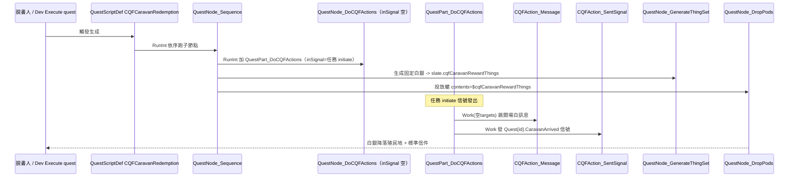

# 結構說明：流民商隊的償還

## 檔案佈局

```
cqf-caravan-redemption/
├── About/About.xml                 # packageId pas.cqf.caravanredemption；硬相依 Harmony+CQF；loadAfter CQF
├── LoadFolders.xml                 # 仿 CQF 自身，v1.6 掛 / 與 1.6
├── 1.6/Defs/
│   ├── QuestScriptDefs/QuestScript_CQFCaravanRedemption.xml   # 任務本體
│   └── ThingSetMakerDefs/ThingSetMaker_CQFCaravanReward.xml   # 固定白銀獎勵模板
├── Languages/
│   ├── English/Keyed/CQFCaravanRedemption.xml                 # CQFAction_Message 的翻譯 key
│   └── ChineseTraditional/Keyed/CQFCaravanRedemption.xml
├── tests/healthcheck.py            # 離線靜態健檢
├── PROJECT.md                      # 衍生目標/參照/完成定義/驗證狀態
├── docs/structure.md               # 本檔
└── session_log.md
```

## 執行流程（runtime）



要點：`QuestNode_DoCQFActions` 的 `inSignal` 留空時，`RunInt` 會以 `slate.Get<string>("inSignal")`（任務 initiate 信號）為準（`decompiled.cs:32802`），故任務一生成即觸發 CQFAction 鏈。

## 之後如何長成「四章故事」

目前是**單章、無地圖、無對話樹**的最小切片。要擴成四章敘事，沿用 CQF 既有能力、仍可大部分純 XML：

1. **第一章｜重逢（現況）**：保留開場白訊息 + 白銀償還。
2. **第二章｜舊路有險**：用 `CustomMapDataDef` 造一張小站點地圖（`terrainsRect`/`thingDatas`/`customThings`），任務節點換 `QuestNode_RandomCustomMap`/`QuestNode_Root_CustomMap`（`decompiled.cs:33090/33215`）生成站點；地圖放 `QE_CustomTrap`（壓力板）與 `QE_LootBox`，踩中/開箱用 `CQFAction_Message + CQFAction_SentSignal` 推進階段。
3. **第三章｜談判**：用 `DialogTreeDef` + `DialogManagerDef` 做多輪對話樹（`decompiled.cs:22474/22279`），以 `CQFAction_StartDialog` 觸發；用 `DialogCondition_Skill`（Social）做說服分支。
4. **第四章｜結算**：用 `CQFAction_Condition` + `DialogCondition_Bool`/`DialogCondition_DatabaseExists` 依前面記錄的旗標/資料庫 key（`CQFAction_SetBool`/`CQFAction_RecordToDatabase`）分歧結局，再用 `QuestNode_GenerateThingSet → QuestNode_DropPods` 或 `CQFAction_ChangeGoodwillOfFaction` 給最終獎賞。

需要 C# 的只有「CQF 沒有的全新副作用/判定」（多半是呼叫第三方 mod API），其餘四章內容預期純 XML 即可，參照 `tutorial/01_add_custom_quest.md` 路徑 A 與作者 SKILL.md。
```
