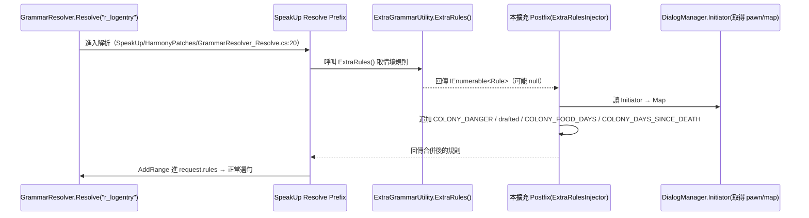

# 新增情境變數說明與建置步驟

本擴充新增 4 個 grammar 關鍵字（屬 3 個情境）。它們由 C# 端
`Source/ExtraRulesInjector.cs` 在 SpeakUp 的 `ExtraGrammarUtility.ExtraRules()` 之後
（Harmony Postfix）注入，故台詞 XML 可直接像用 vanilla 關鍵字一樣引用。

## 注入機制（資料怎麼進到語法解析）



要點：本擴充**不自己 patch `GrammarResolver.Resolve`**，只 Postfix `ExtraRules`，
讓 SpeakUp 既有管線把結果收走，避免兩個 Prefix 競合改同一份 `request.rules`。
數值關鍵字（`COLONY_FOOD_DAYS`、`COLONY_DAYS_SINCE_DEATH`）的 `<`/`>` 比較，
依賴 SpeakUp 既有 `RuleEntry_ValidateConstantConstraints`（`SpeakUp/HarmonyPatches/RuleEntry_ValidateConstantConstraints.cs:43`）。

## 關鍵字一覽

| 關鍵字 | 型別/值 | 語意 | 來源（C#） |
|---|---|---|---|
| `COLONY_DANGER` | `none` / `low` / `high` | 地圖整體威脅等級（raid 進行中等會升到 high） | `Map.dangerWatcher.DangerRating`（`ExtraRulesInjector.cs::AddDangerRules`） |
| `INITIATOR_drafted` / `RECIPIENT_drafted` | `是` / `否` | 該 pawn 是否被玩家徵召（臨戰姿態） | `Pawn.Drafted` |
| `COLONY_FOOD_DAYS` | 數值（天，1 位小數） | 倉庫可食營養 ÷（殖民者數 × 1.6）≈ 還能吃幾天 | `ResourceCounter.TotalHumanEdibleNutrition` ÷ `MapPawns.FreeColonistsCount` |
| `COLONY_DAYS_SINCE_DEATH` | 數值（天，1 位小數）；**無死亡時不發** | 距上次「玩家殖民者死亡」的天數 | `ColonyDeathTracker`（GameComponent）＋ Postfix `Pawn.Kill` |

> `COLONY_DAYS_SINCE_DEATH` 在本局尚未死過殖民者時**完全不會出現**這個 rule。
> 因此 XML 寫 `(COLONY_DAYS_SINCE_DEATH<3)` 隱含「**有死過人且在 3 天內**」——
> 沒死過人的存檔不會誤觸發哀悼台詞。

## 在台詞 XML 怎麼引用

XML 內 `<` `>` 須寫成 `&lt;` `&gt;`。範例（節錄自 `1.6/Patches/zzz_context_expansion.xml`）：

```xml
<!-- 高威脅且被徵召：臨戰 -->
<li>r_logentry(COLONY_DANGER==high,INITIATOR_drafted==是,priority=6)->[ce_combat_drafted]</li>
  <li>ce_combat_drafted->进入战斗位置！别愣着，准备战斗！</li>

<!-- 存糧不到 1 天 -->
<li>r_logentry(COLONY_FOOD_DAYS&lt;1,COLONY_DANGER==none,priority=5)->[ce_food_critical]</li>
  <li>ce_food_critical->我们的存粮快见底了，再不想办法就要饿肚子了。</li>

<!-- 近 3 天內有殖民者死亡 -->
<li>r_logentry(COLONY_DAYS_SINCE_DEATH&lt;3,COLONY_DAYS_SINCE_DEATH&gt;=1,priority=4)->[ce_death_recent]</li>
  <li>ce_death_recent->这几天我一直想着走的那个人。</li>
```

可與既有關鍵字混用（如再加 `INITIATOR_trait==格斗者`、`INITIATOR_mood&lt;0.4`）。
`priority=N` 越高越優先；本擴充把「戰鬥/死亡」設較高，糧食設較低，避免危機時還在閒聊存糧。

## 建置步驟

需要的參考組件（皆已存在於本機）：

| 參考 | 路徑 |
|---|---|
| RimWorld Managed 目錄 | `~/.local/share/Steam/steamapps/common/RimWorld/RimWorldWin64_Data/Managed/`（含 `Assembly-CSharp.dll`、`UnityEngine.dll`、`UnityEngine.CoreModule.dll`） |
| Harmony | `~/.local/share/Steam/steamapps/workshop/content/294100/2009463077/Current/Assemblies/0Harmony.dll` |
| SpeakUp | `~/.local/share/Steam/steamapps/workshop/content/294100/3445623063/1.6/Assemblies/SpeakUp.dll` |
| net48 reference assemblies | NuGet 套件 `microsoft.netframework.referenceassemblies.net48`（dotnet restore 自動取得） |

指令（在 mod 根目錄）：

```bash
dotnet build Source/SpeakUpContextExpansion.csproj -c Release
# 或覆寫參考組件路徑（例如別台機器）：
dotnet build Source/SpeakUpContextExpansion.csproj -c Release \
    /p:RimWorldManaged=/path/to/RimWorld_Data/Managed \
    /p:HarmonyDll=/path/to/0Harmony.dll \
    /p:SpeakUpDll=/path/to/SpeakUp.dll
```

輸出：`1.6/Assemblies/SpeakUpContextExpansion.dll`（OutputPath 已設好）。

> 本機已用 `dotnet build -c Release` 成功編譯（0 警告 0 錯誤），
> DLL assemblyref 僅含 `mscorlib / Assembly-CSharp / SpeakUp / 0Harmony`（無多餘綁定）。

## 安裝 / 啟用

1. 把整個 `speakup-context-expansion/` 資料夾放進 RimWorld 的 `Mods/`（或 Local Mods）。
2. mod 載入順序：Harmony → SpeakUp → 本擴充（About.xml 已設 `loadAfter`）。
3. 進遊戲開 Dev Mode，可在 log 看到
   `[SpeakUpContextExpansion] Harmony patches applied ...` 表示已掛上。
